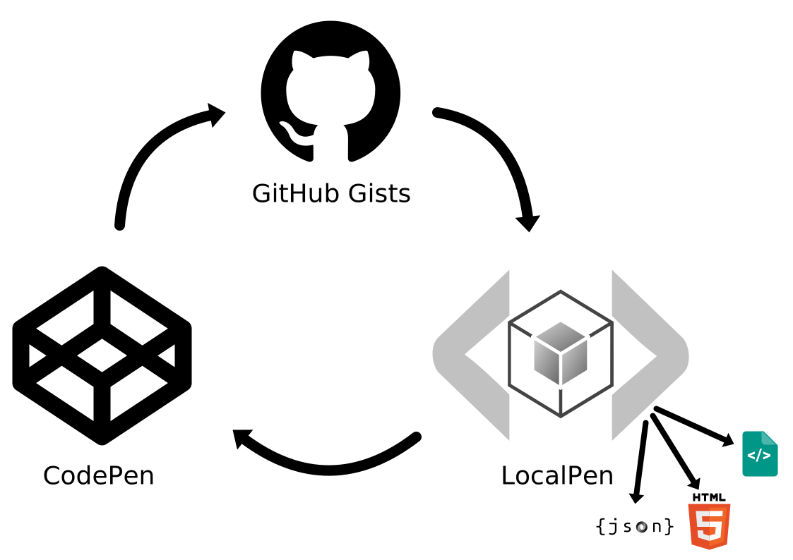

# LocalPen <!-- omit in toc -->

Code pens that run locally!

<p align="center">
</img>
</p>

A powerful frontend coding playground that runs totally on the client and can be hosted on any static file server.

[Try it now on localpen.io](https://localpen.io)

TL;DR: [Getting started](#getting-started)

[](https://cloud.digitalocean.com/apps/new?repo=https://github.com/hatemhosny/localpen/tree/master&refcode=fb8c00b45b91)

## Feature Summary: <!-- omit in toc -->

- [Monaco editor](https://microsoft.github.io/monaco-editor/) (the beautiful code editor that powers [VS Code](https://github.com/Microsoft/vscode))
- [Prettier](https://prettier.io/) code formatting
- Supports many languages (HTML, Markdown, Pug, AsciiDoc, CSS, SCSS, SASS, Less, Stylus, JavaScript, TypeScript, JSX, CoffeeScript and more to come)
- [Emmet](https://emmet.io/) tab completion
- [Autoprefixer](https://github.com/postcss/autoprefixer)
- All code compiling/transpiling occurs on the fly on the client, so works on any static server.
- Immediately result with no server rounds
- Conditional loading of modules (only the features used are downloaded)
- Add external stylesheets and/or scripts
- Import npm modules and use directly without a build step (using the great [skypack.dev](https://www.skypack.dev/))
- Import strongly-typed local typescript modules with full code completion and intellisense.
- Can be embedded in regular web pages
- Code embeds allow editing with the immediate preview
- Resizable split panes (using [split.js](https://github.com/nathancahill/split/))
- Multiple modes: full mode (with split panes), editor only mode, read-only code block mode and result preview mode
- Import code from github and gitlab (gists and repos) or from your web pages
- Immediatley recognize and import codepens exported to github gists
- Export/import projects as JSON
- Export source code as [zip file](https://stuk.github.io/jszip/) or ready-to-run compiled HTML page
- Export to CodePen and JsFiddle (more to come)
- Save/open from local storage with optional autosave
- Keyboard shortcuts
- LocalPen is under active development with more features to come (see [Roadmap](#roadmap))

## Table of Contents <!-- omit in toc -->

- [What makes LocalPen different?](#what-makes-localpen-different)
- [Getting started](#getting-started)
- [Screenshots](#screenshots)
- [Examples](#examples)
- [Settings](#settings)
- [Default Editors](#default-editors)
- [External Stylesheets/Scripts](#external-stylesheetsscripts)
- [Importing ECMAScript Modules](#importing-ecmascript-modules)
  - [Importing NPM Modules](#importing-npm-modules)
  - [Importing Local Modules with TypeScript Types](#importing-local-modules-with-typescript-types)
- [Saving to Device Local Storage](#saving-to-device-local-storage)
- [Importing Code (Editor Prefill)](#importing-code-editor-prefill)
  - [Importing from URL](#importing-from-url)
  - [Importing from CodePen](#importing-from-codepen)
  - ["Edit in LocalPen" Bookmarklet](#edit-in-localpen-bookmarklet)
  - [Prefill From Code Blocks](#prefill-from-code-blocks)
  - [Prefill Editors by Querystring Parameters](#prefill-editors-by-querystring-parameters)
- [Exporting Content](#exporting-content)
  - [Edit in other Services](#edit-in-other-services)
- [Code Formatting](#code-formatting)
- [Keyboard Shortcuts](#keyboard-shortcuts)
- [Display Modes](#display-modes)
- [Embeds](#embeds)
- [API](#api)
- [Roadmap](#roadmap)
- [Limitations](#limitations)
- [Contribution](#contribution)
- [Credits](#credits)
- [License](#license)
- [Support the author](#support-the-author)

## What makes LocalPen different?

The are many great products like [CodePen](https://codepen.io/), [JSFiddle](https://jsfiddle.net/), [JS Bin](https://jsbin.com/?html,output), [JSitor](https://jsitor.com/) and many others, which LocalPen does not aim to replace or compete with. On the contrary, it aims to integrate with many of these services as their APIs allow (e.g. import and export).

However, LocalPen aims to stay as a clien-side only app that can be hosted on any static file server. After the initial loading, using the app can be significantly faster than having to wait for server rounds. Developers should be able to use it offline, while any syncing or sharing capabilities would use external services. Having said that, it is an open-source software, and it should not be difficult to implement a backend for such features if you want to extend it as a different project (may be have a look at [parse starter](https://github.com/hatemhosny/parse-starter)).

The other main goal for LocalPen (in fact, that was the motive for its development), is to provide a feature-rich, easy to use playground that library developers can use for the documentation of their libraries and as a showcase for their products. This includes using the hosted app ([localpen.io](https://localpen.io)), or as a self-hosted option (by including it in their website, or on a separate subdomain for example). Again, being a client-side only app, makes LocalPen more convenient for not needing special server requirements.

Having editable [embeds](#embeds) using a freely-available open-source software becomes very handy. That goal also drives the requirement for being able to import local (unpublished) libraries with strong-typing, editor auto-completion and intellisense support.

LocalPen uses Monaco editor (VS Code editor), Prettier, Emmet and Autoprefixer among others. Your can import NPM modules without a build step. It feels like a very light weight version of your own local development environment with all the intellisense and the auto-completion features, without having to `npm install` anything;

**Important note:** Please note that LocalPen is in early development and may not yet be ready for production use. API may change, and security and performance improvements may still be required. However please take the time to test it. Your feedback and contribution are highly appreciated.

Enough talk, let's get started.

## Getting started

You have multiple options:

- You may just use the hosted app ([localpen.io](https://localpen.io)) and use various methods to add your code like [embedded editors](#embeds), [code blocks](#prefill-from-code-blocks), ["Edit in LocalPen"](#edit-in-localpen-bookmarklet) and [code prefill](#importing-code-editor-prefill).
- One-click [deploy to Digital Ocean](https://cloud.digitalocean.com/apps/new?repo=https://github.com/hatemhosny/localpen/tree/master&refcode=fb8c00b45b91)
- Download the app from the releases, extract the folder and add it to your website.
- Fork the repo, clone it and use the included setup to publish to github pages:

  ```sh
  npm install
  npm run build
  npm run serve         # locally serve to http://127.0.0.2:8080
  npm start             # start local development with code watch, rebuild and live-reload
  npm run gh-pages      # publish to github pages
  ```

- An npm package is also planned.

## Screenshots

<a href="https://hatemhosny.github.io/localpen-examples/images/screenshots/editor-languages.png" target="_blank"></a>
<a href="https://hatemhosny.github.io/localpen-examples/images/screenshots/exports.png" target="_blank"></a>
<a href="https://hatemhosny.github.io/localpen-examples/images/screenshots/imports.png" target="_blank"></a>
<a href="https://hatemhosny.github.io/localpen-examples/images/screenshots/open.png" target="_blank"></a>
<a href="https://hatemhosny.github.io/localpen-examples/images/screenshots/embed-empty.png" target="_blank"></a>
<a href="https://hatemhosny.github.io/localpen-examples/images/screenshots/embed-prefilled.png" target="_blank"></a>
<a href="https://hatemhosny.github.io/localpen-examples/images/screenshots/embed-codeblock.png" target="_blank"></a>
<a href="https://hatemhosny.github.io/localpen-examples/images/screenshots/types1.png" target="_blank"></a>
<a href="https://hatemhosny.github.io/localpen-examples/images/screenshots/types2.png" target="_blank"></a>
<a href="https://hatemhosny.github.io/localpen-examples/images/screenshots/types3.png" target="_blank"></a>
<a href="https://hatemhosny.github.io/localpen-examples/images/screenshots/types4.png" target="_blank"></a>

## Examples

Please note that most of the examples presented in this section are code samples that were publicly available as code pens and were used for demonstration with no or little modifications.

- [Simple jQuery Calculator](https://localpen.io/#https://gist.github.com/hatemhosny/07a742ca9df234cdd433e20cc4e675af) (jQuery)
- [Bootstrap tab panel](https://localpen.io/#https://gist.github.com/hatemhosny/ce9a304057e2dbd66e2a5fa96b72df6a) (Bootstrap)
- [Bootstrap Custom Button SCSS Mixin](https://localpen.io/#https://gist.github.com/hatemhosny/b4a61515f956c1fa7131f392872923a9) (Bootstrap, SCSS)
- [Yet another JavaScript Calculator](https://localpen.io/#https://gist.github.com/aviwarner/3f87dec85a3d84bd3b9bfe634b1e3fa4) (CSS, JS)
- [React Counter](https://localpen.io/#https://gist.github.com/hatemhosny/a0a32216df59e53879b7cd83856cdde4) (React, JSX)
- [Vue.js Counter](https://localpen.io/#https://gist.github.com/hatemhosny/b9ce0ee80da94073cb26cfe46212ea26) (Vue.js)
- [Angular 11 Counter](https://localpen.io/#https://gist.github.com/hatemhosny/a639567e23592b96c2b4de1b53c77263) (Angular 11, Typescript)
- [Preact without JSX](https://localpen.io/#https://gist.github.com/hatemhosny/8d2c23bb86923d351a76a1a2e5c03517) (Preact)
- [Vue.js TodoMVC](https://localpen.io/#https://gist.github.com/hatemhosny/b4b966bdf517e27e712379b24bf625b9) (Vue.js)
- [CSS-only Animated Lantern](https://localpen.io/#https://gist.github.com/hatemhosny/594a6f0982fb012af0da4a94f80fec34)
- [Bootstrap 3 & AngularJS Dialog/Modals](https://localpen.io/#https://gist.github.com/hatemhosny/bd661723e19146ea41bc2bf62d4580b9) (Bootstrap 3, AngularJS)
- [Shooting Star](https://localpen.io/#https://gist.github.com/hatemhosny/dea1f069177c73f515e20476009a5324) (Pug, SCSS, Three.js)
- [Charts info graphic](https://localpen.io/#https://gist.github.com/hatemhosny/6ffa26033947f2b335d4582d7e62e4c9) (D3, SCSS)
- [AngularJs + d3Js + bar chart](https://localpen.io/#https://gist.github.com/hatemhosny/0f3e65c9329f2bce08a7045e551218f1) (AngularJS, D3)
- [Rings Navigation](https://localpen.io/#https://gist.github.com/hatemhosny/3ca25b4cf2cea8772ff7680bb59a1c80) (SCSS, JS)
- [ThreeJS Hover Zoom Channel Displacement](https://localpen.io/#https://gist.github.com/hatemhosny/28e3d1438962da995b7d8909d4cfcce9)
- [D3 Gantt Chart](https://localpen.io/#https://gist.github.com/hatemhosny/e3e79de8a33168ba637d6986c49fc112) (CSS, D3) [from [CodePen](https://codepen.io/jey/pen/jmClJ)]
- [Racing Lines](https://localpen.io/#https://gist.github.com/hatemhosny/9f150679343bc4bb213b7dfcc015e988) (Three.js, TweenMax) [from [CodePen](https://codepen.io/raurir/pen/oXmEPM)]

In fact, most pens on [CodePen](https://codepen.io/) can be imported with no or minor modifications (See [Importing from CodePen](#importing-from-codepen))

## Settings

Most of the settings can be configured from the UI through the settings menu (accessed from the top right gear icon). Many settings can also be configured by URL querystring parameters.

LocalPen uses a configuration file (by default at the url: `/localpen.json`). This can be changed by the querystring parameter `config`, for example:

```
?config=/playground/custom-config.json"
```

Full documentation for configuration will be available when the API gets stable. Meanwhile, the structure and valid values can be found [here](https://localpen.io/api-docs/interfaces/_models_.pen.html). Notice that this is currently subject to change.

## Default Editors

By default, the loaded editors use HTML, CSS and Javascript. If you import code, the editors will use the language of the imported files. However, you may wish to load empty editors with other languages without importing code. You can do that with querystring parameters having the extension (or lowercase name) of the languages you want.

For example, to load editors with HTML, SCSS and TypeScript (with Typescript as the active editor), go to:

https://localpen.io/?ts&scss&html

To load markdown as the active editor, go to:

https://localpen.io/?md

## External Stylesheets/Scripts

External CSS stylesheets and JavaScript files can be added to the page from the UI using the settings menu > External CSS/JS.

These are loaded before the editor codes. You can override CSS properties in them. Global javascript variables defined there should be available to your code.

Importing and Exporting your code to other services (e.g. Codepen and Github gists) takes into consiedration the external resources.

## Importing ECMAScript Modules

### Importing NPM Modules

In LocalPen you can use node-style non-relative imports for node modules like you do in your local development. Yet, there is no build step.

e.g. consider the following code: ([try it here](<https://localpen.io/?js=import%20%7B%20v4%20%7D%20from%20%27uuid%27%3B%0A%0Adocument.body.innerHTML%20%3D%20v4()%3B>))

```js
import { v4 } from 'uuid';

document.body.innerHTML = v4();
```

If you run it in regular web page, you get this error:

```
Uncaught TypeError: Failed to resolve module specifier "uuid". Relative references must start with either "/", "./", or "../".
```

However, in LocalPen, all non-relative imports are converted on-the-fly to use the great service of [skypack.dev](https://www.skypack.dev/).

So

```js
import { v4 } from 'uuid';
```

gets converted to

```js
import { v4 } from 'https://cdn.skypack.dev/uuid';
```

You can import React like that: ([Demo](https://localpen.io/?jsx=script.jsx&html=index.html&css=style.css#https://gist.github.com/hatemhosny/a0a32216df59e53879b7cd83856cdde4))

```js
import React, { useState } from 'react';
import ReactDOM from 'react-dom';
```

It just works without a build step and without you having to worry about. And when you export your code to another service (e.g CodePen or JSFiddle), the full url imports are used, so your code continue to work elsewhere.

It is recommended to use this method for dependencies over using external scripts. The dependencies are explicitly stated in the code. And if you move to a local development environment, your bundler will take care of importing them and doing other optimizations like tree-shaking.

### Importing Local Modules with TypeScript Types

In the [configuration file](#settings), a `modules` property allows to map module names to URLs to retrieve from.

Example config JSON:

```json
{
  "title": "My Project",
  "modules": [
    {
      "name": "my-demo-lib",
      "url": "/modules/my-demo-lib/index.js",
      "typesUrl": "/modules/my-demo-lib/types.d.ts"
    }
  ]
}
```

This allows code like this is the Typescript editor

```typescript
Import { Greeter } from 'my-demo-lib';
const greeter = new Greeter();
greeter.morning();
```

[Working demo](https://localpen.io/?config=https://raw.githubusercontent.com/hatemhosny/localpen-examples/master/build/greeter.json) - [Source Repo](https://github.com/hatemhosny/localpen-examples/)

If your library implements this code, the code will actually work, and you get full intellisense and typing support in the editor. This can be of large benefit for library authors in documentation to serve as playground for their code with editor support and can unleash the full potential of such a strong editor like Monaco editor.

Each item in the modules array may contain the following properties:

- `name`: The module name
- `url`: The URL to the entry point javascript file
- `typesUrl`: The URL to the types declaration file. It has to be a single file. The module name declared in the file has to match the module name you want to use. The library [dts-bundle](https://www.npmjs.com/package/dts-bundle) was found very helpful to prepare such file. ([example](https://github.com/hatemhosny/localpen-examples/blob/master/package.json#L8))

## Saving to Device Local Storage

Projects can be locally saved to device using local storage. You can save a project by clicking `Save` on the settings menu, or simply with the keyboard shortcut `Ctrl/Cmd + S`.
After the initial save, autosave is enabled so that you do not lose code changes. You may disable autosave from the settings menu. It will remain disabled till the next save.

You may also fork the project (save as a new project). Also from the settings menu > Fork, or the keyboard shortcut `Ctrl/Cmd + Shift + S`.

Previously saved projects can be opened from the settings menu > Open. In that screen you can open/delete any project or delete all.

Please note that the projects are locally saved on the device and are not uploaded to the server.

## Importing Code (Editor Prefill)

You can prefill editors with code. This can be great for documentation and sharing links with code.

### Importing from URL

Most commonly, code is imported from a url. You can provide the source url from the UI (settings button > Import), or by adding the url as a hash to the LocalPen url:

(e.g. https://localpen.io/#https://gist.github.com/hatemhosny/a0a32216df59e53879b7cd83856cdde4)

LocalPen can detect and automatically load code from multiple sources. Currently the supported sources are:

- Github gists (imports multiple files in the gist)
- A directory in a github repo (multiple files)
- A file in a github repo (imports that single file)
- Gitlab snippets (imports multiple files in the snippet)
- A directory in a gitlab repo (multiple files)
- A file in a gitlab repo (imports that single file)
- Extract code blocks from a webpage (see [code blocks](#prefill-from-code-blocks))
- Otherwise the url will be considered a raw file (like raw files on github)

If the source url points to multiple files (e.g github gists and directories), LocalPen tries to guess which file to load each in which code editor (e.g index.html -> markup, my-style.css -> style, app.js -> script). All supported languages can be used. If the source url points to multiple files of the same category, guessing may not wark well. In this case, you may need to provide the files to load and the language for each as querystring params. For example:

```
https://localpen.io/?pug=page.pug&scss=styles.scss&ts=app.ts#https://github.com/myuser/myrepo/tree/master/mydir
```

LocalPen will look for the directory `mydir` in the github repo `myuser/myrepo`, and load `page.pug` in the markup editor, `styles.scss` in the styles editor, and `app.ts` in the script editor. The first file in the query string will be shown by default (`page.pug` in this case).

### Importing from CodePen

Currently, CodePen API does not allow directly importing code from pens. However, you can export any saved pen as a Github gist and then import it to LocalPen. This is even easier if you use the [bookmarklet](#edit-in-localpen-bookmarklet). The format that Codepen exports to gists is well understood by LocalPen. Most pens can be imported with no or minimal changes.

### "Edit in LocalPen" Bookmarklet

Instead of manually copy/pasting URLs to import, the bookmarklet can be very convenient. It opens LocalPen in a new window and adds the webpage URL as a hash. Create a new bookmark in your browser and add this code as its URL:

```js
javascript: (function () {
  window.open('https://localpen.io/#' + location.href, '_blank');
})();
```

Or just drag the following link, and drop it to the bookmarks bar:
<a href="javascript:(function(){window.open('https://localpen.io/#' + location.href, '_blank')})();">Edit in LocalPen</a>

### Prefill From Code Blocks

Editors can be prefilled by code blocks in web pages. The page is fetched, its HTML is parsed and code is extracted from elements with specific CSS selectors.

**Important Note:** For this to work, CORS has to be enabled on the target host to allow fetch requests from LocalPen. This is not required if LocalPen is hosted on the same host of the target web page.

By default, LocalPen looks for elements that match the CSS selector `.localpen [data-lang="${language}"]`.

for example, in this code block:

```html
<code class="localpen">
  <pre data-lang="html">
This is identified as &lt;strong&gt;HTML&lt;/strong&gt; code
</pre
  >
</code>
```

this string is considered HTML code to prefill the editor: `This is identified as <strong>HTML</strong> code`

Notice that angled brackets should be encoded to avoid interference with the HTML of the page.

[This is a demo](https://hatemhosny.github.io/localpen-examples/prefill-from-code-blocks.html) for automatic extraction of code blocks to prefill editors by creating "Edit in LocalPen" links. Also embedded editors are prefilled from the code blocks. ([View source](https://github.com/hatemhosny/localpen-examples/blob/master/prefill-from-code-blocks.html))

### Prefill Editors by Querystring Parameters

You can prefill the editors by writing content as querystring parameter values, e.g.:

https://localpen.io/?css=h1{color:blue;}&html=%3Ch1%3EHello%20World%3C/h1%3E

This link preloads the CSS and HTML editors with content and makes the CSS the default editor. This can be convenient to share links with preloaded cotent without using an external service. However, please be cautious with this method because you quickly reach the ~2000 character limit of URL length. You also need to URI-encode the content (which you can do in JavaScript using the `encodeURI` and `encodeURIComponent` methods).

## Exporting Content

Projects in LocalPen can be exported as:

- JSON: this is a JSON representation of the project configuration with the project source code included. This allows re-importing or sharig your projects.
- Source: The source code is exported as separate files in a single zip file. This is your untouched source code.
- Result: The combined compiled/transpiled code is exported as a ready-to-run HTML file. You may run it by simply opening the file in the browser, or using a simple local http server, for example:
  ```sh
  npx http-server
  ```

### Edit in other Services

Currently LocalPen can export content to [CodePen](https://codepen.io/) and [JSFiddle](https://jsfiddle.net/). This is accessible from the settings menu > Export.

It is planned to support more services.

This allows you to move code between different services.
This is a summary overview of moving code between LocalPen, CodePen and GitHub gists:



Remember, you can always export your code from LocalPen as raw source code files, compiled/transpiled code as an HTML file or as project configuration JSON.

## Code Formatting

The popular code formatter, [Prettier](https://prettier.io/), is included out-of-the-box in LocalPen. Code formatting and preview update are triggered by the keyboard shortcut `Ctrl + Enter` (on Windows) or `Cmd + Enter` (on Mac).

## Keyboard Shortcuts

- `Ctrl/Cmd + Enter`: Code format + update preview
- `Ctrl/Cmd + N`: New project
- `Ctrl/Cmd + S`: Save
- `Ctrl/Cmd + Shift + S`: Fork (Save as new project)
- `Ctrl/Cmd + P`: Monaco editor command palette

These are in addition to the Monaco editor [keyboard shortcuts](https://code.visualstudio.com/shortcuts/keyboard-shortcuts-windows.pdf) (PDF) that you probably use in VS Code.

## Display Modes

The querystring parameter `mode` can be used to select different display modes.
The following display modes are supported:

- `full`: This is the default mode with a top toolbar, editor and results panes.

  example: https://localpen.io/

- `editor`: Hides the results pane and works as editor only.

  example: https://localpen.io/?mode=editor

- `codeblock`: A read-only mode just showing only the code block. On mouse-over a copy button appears that allows to copy the code. This is useful when embedded

  example: [Demo](https://hatemhosny.github.io/localpen-examples/embed.html#codeblock) [View source](https://github.com/hatemhosny/localpen-examples/blob/master/embed.html#L56)

<!-- TODO -->

## Embeds

The code editor can be embedded in web pages using iframes. They can still be fully functional and editable unless, for example mode is set to codeblock. Notice they can also prefilled with code, the same way [described before](#importing-code-editor-prefill).

Examples: [Demo](https://hatemhosny.github.io/localpen-examples/embed.html) - [Full Source](https://github.com/hatemhosny/localpen-examples/blob/master/embed.html)

```html
<iframe src="https://localpen.io/"></iframe>

<iframe
  src="https://localpen.io/#https://gist.github.com/hatemhosny/a0a32216df59e53879b7cd83856cdde4"
></iframe>

<iframe
  src="https://localpen.io/?mode=codeblock&js=script.jsx#https://gist.github.com/hatemhosny/a0a32216df59e53879b7cd83856cdde4"
></iframe>
```

[This is a demo](https://hatemhosny.github.io/localpen-examples/prefill-from-code-blocks.html) for embedded editors that are prefilled by code blocks in the HTML of the web page that contains them. ([View source](https://github.com/hatemhosny/localpen-examples/blob/master/prefill-from-code-blocks.html))

## API

The documentation for API and configuration specs will be published on a separate documentation website when the API becomes stable. Meanwhile, you can have an idea about the configuration structure by exporting the project JSON.

## Roadmap

Many features/fixes are planned, the most important are:

- [ ] Add JavaScript console.
- [ ] Enhancing security
- [ ] Add starter templates (standard and user-defined)
- [ ] CSS presets (e.g. normalize, reset)
- [ ] Improve embedded editors
- [ ] Click to load embeds
- [ ] NPM package
- [ ] View compiled code
- [ ] Offline support (PWA)
- [ ] Github login
- [ ] Export/import from services like google drive/dropbox
- [ ] Support different layouts
- [ ] Small footer with quick tasks
- [ ] Documentation website
- [ ] Add tests
- [ ] Try automatically detecting and loading typescript types
- [ ] Support more languages
- [ ] Improve build process and decrease file size
- [ ] Various bug fixes and performance improvements
- [ ] Improve UX while loading

#### and may be: <!-- omit in toc -->

- [ ] browser extension (similar to [Web Maker](https://webmaker.app/))
- [ ] Support creating exercises with unit test checks

## Limitations

- Client-side only!
- The Monaco editor is **not** supported in mobile browsers.

## Contribution

Please do!

Feedback, ideas and pull requests are highly appreciated.

## Credits

In addition to all the previously mentioned great products, LocalPen was inspired and initially based on [monacode](https://github.com/lukejacksonn/monacode/).

## License

MIT

## Support the author

Supporting the author allows continued work on open-source software, and keeps [localpen.io](https://localpen.io) free of ads.

[](https://ko-fi.com/N4N036P4Y)
