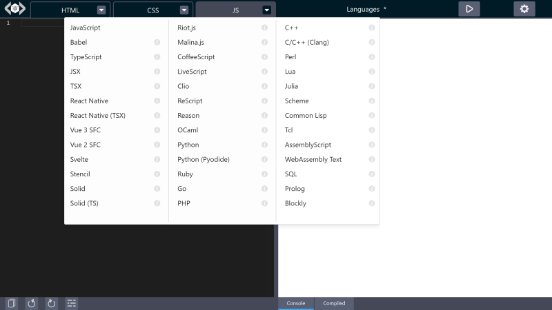

# Configuration Object

import LiveCodes from '../../src/components/LiveCodes.tsx';

LiveCodes is very flexible and provides a wide range of configuration options.
A JavaScript object is used for configuration and keeping state.

## Usage

The configuration object can be used while initializing a new playground using the [SDK](../sdk/index.md).

```ts
import { createPlayground } from 'livecodes';

(async () => {
  const playground = await createPlayground('#container', {
    config: {
      // config options here
    },
  });

  // the object can be retrieved using the method `getConfig`
  console.log(await playground.getConfig());

  // and can be later changed using the method `setConfig`
  await playground.setConfig({
    // new config options
  });
})();
```

Alternatively, the URL [query parameter](./query-params.md) `config` can provide a URL to a JSON representation of the configuartion object to be used while initializing the app.

Example:

```
https://livecodes.io/?config=https://my-custom-server.com/config.json
```

## TypeScript Types

TypeScript types are [documented here](../api/interfaces/Config.md) and can be imported from the library.

```ts
import type { Config } from 'livecodes';
```

## Default Config

Default config is [defined here](https://github.com/live-codes/livecodes/blob/develop/src/livecodes/config/default-config.ts).

## Project Content

These are properties that define the content of the current [project](../features/projects.md).

### `title`

Type: [`string`](../api/interfaces/Config.md#title)

Default: `"Untitled Project"`

Project title. This is used as [result page](../features/result.md) title and title meta tag. Also used in [project](../features/projects.md) search. This can be set in the UI from the title input (above result page) or from app menu → Project Info.

### `description`

Type: [`string`](../api/interfaces/Config.md#description)

Default: `""`

Project description. Used in [project](../features/projects.md) search and result page description meta tag. This can be set in the UI from app menu → Project Info.

### `head`

Type: [`string`](../api/interfaces/Config.md#head)

Default: `'<meta charset="UTF-8" />\n<meta name="viewport" content="width=device-width, initial-scale=1.0" />'`

Content added to the [result page](../features/result.md) `<head>` element. This can be set in the UI from app menu → Project Info.

### `htmlAttrs`

Type: [`string | Record<string, string>`](../api/interfaces/Config.md#htmlattrs)

Default: `'lang="en" class=""'`

Attributes added to the [result page](../features/result.md) `<html>` element. It can be an object or a string.

Example: `{ lang: "en", class: "dark" }` or `'lang="en" class="dark"'`,  
become `<html lang="en" class="dark">`.

This can be set in the UI from app menu → Project Info.

### `tags`

Type: [`string[]`](../api/interfaces/Config.md#tags)

Default: `[]`

Project tags. Used in [project](../features/projects.md) filter and search. This can be set in the UI from app menu → Project Info.

### `activeEditor`

Type: [`"markup" | "style" | "script" | undefined`](../api/interfaces/Config.md#activeeditor)

Default: Last used editor for user, otherwise "markup"

Selects the active editor to show.

### `languages`

Type: [`Language[] | undefined`](../api/interfaces/Config.md#languages)

Default: all supported languages in full app and only current editor languages in [embeds](../features/embeds.md).

List of enabled languages. Languages that are not already loaded in the editors ([markup](#markup), [style](#style) and [script](#script)) can be selected from a drop down menu at the editor title.



### `markup`

Type: [`Editor`](../api/interfaces/internal.Editor.md)

Default: `{ language: "html", content: "" }`

An object that configures the language and content of the markup editor. This can include the following properties:

- `language`:  
  Type: [Language](../api/modules/internal.md#language)  
  Default: `"html"` in markup editor, `"css"` in style editor and `"javascript"` in script editor.  
  This can be a language name, extension or alias (as defined in [language documentations](../languages/index.md)).  
  (e.g. `"markdown"`, `"md"`)

- `content`:
  Type: [`string | undefined`](../api/interfaces/internal.Editor#content)  
  Default: `""`

- `contentUrl`:
  Type: [`string | undefined`](../api/interfaces/internal.Editor#contenturl)  
  Default: `undefined`  
  A URL to load `content` from. It has to be a valid URL that is CORS-enabled.  
  The URL is only fetched if `content` property had no value.

- `hiddenContent`:
  Type: [`string | undefined`](../api/interfaces/internal.Editor#hiddencontent)  
  Default: `undefined`  
  Hidden content that gets evaluated without being visible in the code editor.
  This can be useful in embedded playgrounds (e.g. for adding helper functions, utilities or tests)

- `hiddenContentUrl`:
  Type: [`string | undefined`](../api/interfaces/internal.Editor#hiddencontenturl)  
  Default: `undefined`  
  A URL to load `hiddenContent` from. It has to be a valid URL that is CORS-enabled.  
  The URL is only fetched if `hiddenContent` property had no value.

- `selector`:
  Type: [`string | undefined`](../api/interfaces/internal.Editor#selector)  
  Default: `undefined`  
  A CSS selector to load `content` from [DOM import](../features/import.md#import-code-from-dom).

- `position`:
  Type: [`{lineNumber: number, column?: number} | undefined`](../api/interfaces/internal.Editor#position)  
  Default: `undefined`  
  The initial position of the cursor in the code editor.

### `style`

Type: [`Editor`](../api/interfaces/internal.Editor.md)

Default: `{ language: "css", content: "" }`

An object that configures the language and content of the style editor. See [markup](#markup) for more details.

### `script`

Type: [`Editor`](../api/interfaces/internal.Editor.md)

Default: `{ language: "javascript", content: "" }`

An object that configures the language and content of the script editor. See [markup](#markup) for more details.

### `stylesheets`

Type: [`string[]`](../api/interfaces/Config.md#stylesheets)

Default: `[]`

List of URLs for [external stylesheets](../features/external-resources.md) to add to the [result page](../features/result.md).

### `scripts`

Type: [`string[]`](../api/interfaces/Config.md#scripts)

Default: `[]`

List of URLs for [external scripts](../features/external-resources.md) to add to the [result page](../features/result.md).

### `cssPreset`

Type: [`"" | "normalize.css" | "reset-css"`](../api/interfaces/Config.md#csspreset)

Default: `""`

[CSS Preset](../features/external-resources.md#css-presets) to use.

### `processors`

Type: [`Processor[]`](../api/modules#processor)

Default: `[]`

List of enabled [CSS processors](../features/css.md#css-processors).

### `customSettings`

Type: [`CustomSettings`](../api/interfaces/Config.md#customsettings)

Default: `{}`

Defines [custom settings](../advanced/custom-settings.md) for the current project.

### `imports`

Type: [`[key: string]: string`](../api/interfaces/Config.md#imports)

Default: `{}`

Allows specifying custom [import maps](https://github.com/WICG/import-maps) for [module imports](../features/module-resolution.md#custom-module-resolution).

For example, adding this JavaScript code:

```js
import moment from 'moment';
import { partition } from 'lodash';
```

would add this import map in the result page:

```html
<script type="importmap">
  {
    "imports": {
      "moment": "https://cdn.skypack.dev/moment",
      "lodash": "https://cdn.skypack.dev/lodash"
    }
  }
</script>
```

However, if `imports` is specified as follows:

```json
{
  "imports": {
    "moment": "https://cdn.jsdelivr.net/npm/moment@2.29.4/dist/moment.js"
  }
}
```

The import map becomes like this:

```html
<script type="importmap">
  {
    "imports": {
      "moment": "https://cdn.jsdelivr.net/npm/moment@2.29.4/dist/moment.js",
      "lodash": "https://cdn.skypack.dev/lodash"
    }
  }
</script>
```

:::info Note

Currently, multiple import maps are not yet supported. https://crbug.com/927119

When bare module imports are encountered, LiveCodes adds an import map to the result page. If you need to add custom import map or override the automatically generated one, you need to add them to `imports` config property or `imports` [customSettings](#customsettings) property.

:::

### `types`

Type: [`[key: string]: string | { autoload?: boolean ; declareAsModule?: boolean ; url: string }`](../api/interfaces/internal.Types.md)

Default: `{}`

Allows providing custom [TypeScript type declarations](https://www.typescriptlang.org/docs/handbook/2/type-declarations.html) for better [editor intellisense](../features/intellisense.md).

It is an object where each key represents module name and value represents the types.
This can be a URL to a type declaration file. For example, if this is the type declaration file:

```ts title="https://my-custom-domain/my-type-declarations.d.ts"
declare module 'my-demo-lib' {
  export class Greeter {
    morning(): string;
    evening(): string;
  }
}
```

It can be used like that:

```json
{
  "types": {
    "my-demo-lib": "https://my-custom-domain/my-type-declarations.d.ts"
  }
}
```

Alternatively, the value for module name can be an object with the following proprties:

- `url`: `string` (required). The URL to type declaration file.
- `autoload`: `boolean` (optional). By default, the types are only loaded when the module is imported in code. If `autoload` property is set to `true`, the types are loaded regardless if the module was imported.
- `declareAsModule`: `boolean` (optional). Declares the types as module with the supplied module name.

Example:

```json
{
  "types": {
    "my-demo-lib": {
      "url": "https://my-custom-domain/types.d.ts",
      "autoload": true,
      "declareAsModule": true
    }
  }
}
```

### `tests`

Type: `undefined` | `Partial`<[`Editor`](../api/interfaces/internal.Editor.md)>

Default: `{ language: 'typescript', content: '' }`

Configures the [language](../features/tests.md#supported-languages) and content of [tests](../features/tests.md).

### `version`

Type: `Readonly` [`string`](../api/interfaces/Config.md#description)

Default: Current LiveCodes Version.

This is a read-only property which specifies the current LiveCodes version. It can be shown using the SDK [`exec`](../sdk/js-ts.md#exec) method.

```js
// in browser console of full app (e.g. https://livecodes.io)
await livecodes.exec('showVersion');
```

Version specified in [exported](../features/export.md) projects allows automatically upgrading the project configuration when imported by an app with a newer version.

## App Settings

These are properties that define how the app behaves.

### `readonly`

Type: [`boolean`](../api/interfaces/Config.md#readonly)

Default: `false`

If `true`, editors are loaded in read-only mode, where the user is not allowed to change the code.

By default, when `readonly` is set to `true`, the light-weight code editor [CodeJar](../features/editor-settings.md#code-editor) is used. If you wish to use another editor, set the [editor](#editor) property.

### `allowLangChange`

Type: [`boolean`](../api/interfaces/Config.md#allowlangchange)

Default: `true`

If `false`, the UI will not show the menu that allows changing editor language.

### `mode`

Type: [`"full" | "focus" | "simple" | "result" | "editor" | "codeblock"`](../api/interfaces/Config.md#mode)

Default: `"full"`

Sets [display mode](../features/display-modes.md)

### `tools`

Type: [`Partial<{ enabled: Array<'console' | 'compiled' | 'tests'> | 'all'; active: 'console' | 'compiled' | 'tests' | ''; status: 'closed' | 'open' | 'full' | 'none' | ''; }>`](../api/interfaces/Config.md#tools)

Default: `{ enabled: 'all', active: '', status: '' }`

Sets enabled and active tools and status of [tools pane](../features/tools-pane.md).

Example:

```json
{
  "tools": {
    "enabled": ["console", "compiled"],
    "active": "console",
    "status": "open"
  }
}
```

<LiveCodes config={{script: {language: "javascript", content: "console.log('Hello World!');"}, activeEditor: "script", tools: {enabled: ["console", "compiled"], active: "console", status: "open"}}}></LiveCodes>

### `zoom`

Type: [`1 | 0.5 | 0.25`](../api/interfaces/Config.md#zoom)

Default: `1`

Sets result page [zoom level](../features/result.md#result-page-zoom).

## User Settings

These are properties that define the [user settings](./../features/user-settings.md), including [editor settings](../features/editor-settings.md).

### `enableAI`

Type: [`boolean`](../api/interfaces/Config.md#enableai)

Default: `false`

If `true`, [AI code assistant](../features/ai.md) is enabled.

### `autoupdate`

Type: [`boolean`](../api/interfaces/Config.md#autoupdate)

Default: `true`

If `true`, the result page is automatically updated on code change, after time [delay](#delay).

### `autosave`

Type: [`boolean`](../api/interfaces/Config.md#autosave)

Default: `false`

If `true`, the project is automatically saved on code change, after time [delay](#delay).

### `autotest`

Type: [`boolean`](../api/interfaces/Config.md#autotest)

Default: `false`

If `true`, the project is watched for code changes which trigger tests to auto-run.

### `delay`

Type: [`number`](../api/interfaces/Config.md#delay)

Default: `1500`

Time delay (in milliseconds) follwing code change, after which the result page is updated (if [`autoupdate`](#autoupdate) is `true`) and/or the project is saved (if [`autosave`](#autosave) is `true`).

### `formatOnsave`

Type: [`boolean`](../api/interfaces/Config.md#formatonsave)

Default: `false`

If `true`, the code is automatically [formatted](../features/code-format.md) on saving the project.

### `layout`

Type: [`"horizontal"| "vertical" | "responsive"  | undefined`](../api/interfaces/Config.md#layout)

Default: `"responsive"`

Sets the app layout to horizontal or vertical. If set to `"responsive"` (the default) or `undefined`, the layout is vertical in small screens when the playground height is larger than its width, otherwise horizontal.

### `theme`

Type: [`"light" | "dark"`](../api/interfaces/Config.md#theme)

Default: `"dark"`

Sets the app [theme](../features/themes.md) to light/dark mode.

### `editorTheme`

Type: [`EditorTheme[] | string | undefined`](../api/interfaces/Config.md#editortheme)

Default: `undefined`

Sets the editor [themes](../features/themes.md).

:::info Note
You can preview and set editor themes in the [editor settings screen](pathname:///../?screen=editor-settings).
:::

Three [code editors](#editor) are supported in LiveCodes: **Monaco** (the default on desktop), **CodeMirror** (the default on mobile) and **CodeJar** (the default in [codeblocks](../features/display-modes.md#codeblock), in [lite mode](../features/lite.md) and in [readonly](#readonly) playgrounds). Each editor has its own set of themes, represented by the types: [`MonacoTheme`](../api/modules/internal/#monacotheme), [`CodemirrorTheme`](../api/modules/internal/#codemirrortheme) and [`CodejarTheme`](../api/modules/internal/#codejartheme).

The `editorTheme` property can be used to set the editor theme for each editor and on light/dark modes. It can be set to an array of [`EditorTheme`](../api/modules/internal#editortheme) items or a string of comma-separated items.

Each item can be composed of:

` editor:` `theme-name` `@app-theme`

Where:

- `editor` is the name of the editor (`"monaco" | "codemirror" | "codejar"`). [Optional]
- `theme-name` is the name of the theme (e.g. `"monokai"`). [Required]  
  Valid theme names can be found here:
  - Monaco: [`MonacoTheme`](../api/modules/internal/#monacotheme)
  - CodeMirror: [`CodemirrorTheme`](../api/modules/internal/#codemirrortheme)
  - CodeJar: [`CodejarTheme`](../api/modules/internal/#codejartheme]).
- `app-theme` is the name of the app theme (`"dark" | "light"`). [Optional]

Examples:

- `"vs"`
- `"monaco:twilight, codemirror:one-dark"`
- `["vs@light"]`
- `["vs@light", "vs-dark@dark"]`
- `["monaco:vs@light", "codemirror:github-light@light", "dracula@dark"]`

Each `EditorTheme` item requires a theme name. The theme name can optionally be preceded with the editor name separated by a colon to specify the editor (e.g. `"monaco:monokai"`). It can also optionally be followed by the app theme separated by "@" (e.g. `"monokai@dark"`).

Multiple `EditorTheme` items can be supplied (as array items or in the comma-separated string) to specify the theme for each editor and in dark and light modes. The order matters. The first valid item in the array or string for the current editor (`monaco`, `codemirror` or `codejar`) and app theme (`light` or `dark`) will be used. If no items match the current editor and app theme, the default theme for the editor and app theme will be used.

### `recoverUnsaved`

Type: [`boolean`](../api/interfaces/Config.md#recoverunsaved)

Default: `true`

Enables [recovering last unsaved project](../features/recover.md) when the app is reopened.

### `showSpacing`

Type: [`boolean`](../api/interfaces/Config.md#showspacing)

Default: `false`

Enables [showing element spacing](../features/result.md#show-spacings) in the result page.

### `editor`

Type: [`"monaco" | "codemirror" | "codejar" | undefined`](../api/interfaces/Config.md#editor)

Default: `undefined`

Selects the [code editor](../features/editor-settings.md#code-editor) to use.

If `undefined` (the default), Monaco editor is used on desktop, CodeMirror is used on mobile and CodeJar is used in [codeblocks](../features/display-modes.md#codeblock), in [lite mode](../features/lite.md) and in [readonly](#readonly) playgrounds.

### `fontFamily`

Type: [`string | undefined`](../api/interfaces/Config.md#fontfamily)

Default: `undefined`

Sets the [code editor](../features/editor-settings.md) font family.

### `fontSize`

Type: [`number | undefined`](../api/interfaces/Config.md#fontfamily)

Default: `undefined`

Sets the [code editor](../features/editor-settings.md) font size.

If `undefined` (the default), the font size is set to 14 for the full app and 12 for [embeds](../features/embeds.md).

### `useTabs`

Type: [`boolean`](../api/interfaces/Config.md#usetabs)

Default: `false`

If `true`, lines are indented with tabs instead of spaces. Also used in [code formatting](../features/code-format.md).

### `tabSize`

Type: [`number`](../api/interfaces/Config.md#tabsize)

Default: `2`

The number of spaces per indentation-level. Also used in [code formatting](../features/code-format.md).

### `lineNumbers`

Type: [`boolean`](../api/interfaces/Config.md#linenumbers)

Default: `true`

Show line numbers in [code editor](../features/editor-settings.md).

### `wordWrap`

Type: [`boolean`](../api/interfaces/Config.md#wordwrap)

Default: `false`

Enables word-wrap for long lines.

### `closeBrackets`

Type: [`boolean`](../api/interfaces/Config.md#closebrackets)

Default: `true`

Use auto-complete to close brackets and quotes.

### `emmet`

Type: [`boolean`](../api/interfaces/Config.md#emmet)

Default: `true`

Enables [emmet](../features/editor-settings.md#emmet).

### `editorMode`

Type: [`"vim" | "emacs" | undefined`](../api/interfaces/Config.md#editormode)

Default: `undefined`

Sets [editor mode](../features/editor-settings.md#editor-modes).

### `semicolons`

Type: [`boolean`](../api/interfaces/Config.md#semicolons)

Default: `true`

Configures Prettier [code formatter](../features/code-format.md) to use [semi-colons](https://prettier.io/docs/en/options.html#semicolons).

### `singleQuote`

Type: [`boolean`](../api/interfaces/Config.md#singlequote)

Default: `false`

Configures Prettier [code formatter](../features/code-format.md) to use [single quotes instead of double quotes](https://prettier.io/docs/en/options.html#quotes).

### `trailingComma`

Type: [`boolean`](../api/interfaces/Config.md#trailingcomma)

Default: `true`

Configures Prettier [code formatter](../features/code-format.md) to use [trailing commas](https://prettier.io/docs/en/options.html#trailing-commas).
