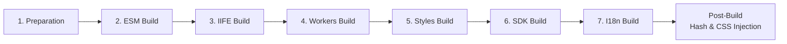

# Build System

This document describes the build system architecture, processes, and outputs for LiveCodes.

## Overview

LiveCodes uses [esbuild](https://esbuild.github.io/) as its primary bundler for fast, efficient builds. The build system handles three main outputs:

1. **App** (`build/livecodes/`) - The main application
2. **SDK** (`build/sdk/`) - The embeddable SDK package
3. **Docs** (`build/docs/`) - Documentation site

## Build Commands

```bash
npm run build             # Full production build (app + docs + storybook)
npm run build:app        # Build app only
npm run start             # Dev server with watch (http://127.0.0.1:8080)
npm run clean             # Remove build directory
```

### Development Mode

The development server includes hot-reload capabilities:

```bash
npm run start             # Runs: copy:assets, watch, serve in parallel
```

- **serve:app**: Serves files from `build/` directory
- **serve:sandbox**: Serves sandbox HTML for testing
- **watch**: Uses nodemon to watch `src/` and rebuild on changes

## Build Architecture

### Core Build Script

The main build script is located at `scripts/build.js`. It orchestrates all build tasks:

### Build Phases



#### 1. Preparation (`prepareDir`)

- Creates output directories (`build/livecodes/`, `build/sdk/`, `build/tmp/`)
- Cleans previous build artifacts
- Copies static files (`favicon.ico`, `404.html`, `index.html`, `app.html`, `netlify.toml`, `_headers`)

#### 2. ESM Build (`esmBuild`)

Builds ES modules for the main application entry points:

- `app.ts` - Main application
- `embed.ts` - Embed mode
- `headless.ts` - Headless mode

and other lazy-loaded modules, including:
- Editor modules (Monaco, CodeMirror, CodeJar, Blockly, Quill)
- Language compilers/processors
- UI components (assets, backup, broadcast, deploy, embed-ui, etc.)
- Services (firebase, google-fonts)
- Import/export modules

Configuration:
- Format: `esm`
- Minification: enabled in production

#### 3. IIFE Build (`iifeBuild`)

Builds Immediately Invoked Function Expression bundles for:

- Main entry (`index.ts`)
- Compile page script
- Compiler utilities
- Language-specific compilers (Svelte, Vue, Astro, etc.)
- Result utilities
- Custom editor utilities

These are loaded via script tags and execute immediately.

#### 4. Workers Build (`workersBuild`)

Builds Web Workers for parallel processing:

- `compile.worker.ts` - Compilation worker
- `format.worker.ts` - Code formatting worker
- `sync.worker.ts` - Synchronization worker

Workers are wrapped in IIFE format for compatibility.

#### 5. Styles Build (`stylesBuild`)

Located in `scripts/styles.js`:

- Compiles SCSS files from `src/livecodes/styles/` to CSS
- Uses Sass compiler
- Applies PostCSS with autoprefixer
- Output: `build/livecodes/*.css`

#### 6. SDK Build (`sdkBuild`)

Builds the SDK for multiple environments:

| Entry Point | Output Format | Description |
|-------------|---------------|-------------|
| `index.ts` | ESM (`livecodes.js`) | ES modules SDK |
| `index.ts` | CJS (`livecodes.cjs`) | CommonJS SDK |
| `livecodes.umd.ts` | IIFE (`livecodes.umd.js`) | UMD bundle |
| `preact.ts` | ESM | Preact wrapper |
| `react.tsx` | ESM | React wrapper |
| `solid.ts` | ESM | Solid wrapper |
| `svelte.ts` | ESM | Svelte wrapper |
| `vue.ts` | ESM | Vue wrapper |
| `web-components.ts` | IIFE | Web Components |

SDK packages externalize framework dependencies (`preact`, `react`, `solid-js`, `svelte`, `vue`).

Type declarations are generated via TypeScript compiler (`tsconfig.sdk.json`), then cleaned and optionally bundled.

#### 7. I18n Build (`buildI18n`)

Located in `scripts/i18n.js`:

- Compiles locale files from `src/livecodes/i18n/locales/*/`
- Outputs JSON files: `build/livecodes/i18n-{locale}-{namespace}.json`
- Generates locale path loader for dynamic imports

See [i18n.mdx](./i18n.mdx) for details.

### Post-Build Processing

#### Hash Application (`scripts/hash.js`)

Applies content-based MD5 hashes to filenames for cache busting:

```js
// In source code
const mod = await import(baseUrl + '{{hash:file-name.js}}');

// After build (content hash added)
const mod = await import(baseUrl + 'file-name.abc123...js');
```

Benefits:
- Aggressive caching (1 year) with cache invalidation on change
- Consistent hashes for unchanged files across builds

#### CSS Injection (`scripts/inject-css.js`)

- Inlines `src/livecodes/styles/index.css` content directly into `src/index.html`
- Reduces HTTP requests for critical CSS

## Output Structure

### App Output (`build/livecodes/`)

```
build/livecodes/
├── app.{hash}.js          # Main application bundle
├── app.{hash}.css         # Application styles
├── index.{hash}.js        # Entry point (IIFE)
├── embed.{hash}.js        # Embed mode
├── headless.{hash}.js     # Headless mode
├── compile.worker.{hash}.js
├── format.worker.{hash}.js
├── sync.worker.{hash}.js
├── monaco.{hash}.js       # Monaco editor
├── codemirror.{hash}.js   # CodeMirror editor
├── codejar.{hash}.js      # CodeJar editor
├── lang-*.{hash}.js       # Language compilers
├── i18n-{locale}-{ns}.{hash}.json  # Translations
├── assets/                # Static assets
└── ...                    # Other modules
```

### SDK Output (`build/sdk/`)

```
build/sdk/
├── livecodes.js          # ESM SDK
├── livecodes.cjs         # CommonJS SDK
├── livecodes.umd.js      # UMD bundle
├── preact.js             # Preact wrapper
├── react.js              # React wrapper
├── solid.js              # Solid wrapper
├── svelte.js             # Svelte wrapper
├── vue.js                # Vue wrapper
├── web-components.js     # Web Components wrapper
├── LiveCodes.svelte      # Svelte component source
├── types/                # TypeScript declarations
│   ├── index.d.ts        # SDK entry point types
│   ├── livecodes.d.ts    # Legacy bundled types
│   ├── models.d.ts
│   └── *.d.ts            # Framework type declarations
├── package.json
├── LICENSE
└── README.md
```

### Final Output (`build/`)

```
build/
├── index.html            # Main entry page
├── app.html              # App shell
├── 404.html              # 404 page
├── favicon.ico
├── llms.txt              # LLM documentation
├── llms-full.txt         # Full LLM documentation
├── netlify.toml          # Netlify config
├── livecodes/            # App files
├── sdk/                  # SDK files
├── docs/                 # Documentation site
└── stories/              # Storybook site
```

## Environment Variables

Build-time environment variables (set in `getEnvVars()` in `scripts/utils.js`):

| Variable | Description |
|----------|-------------|
| `BASE_URL` | Base URL for deployment (e.g., `/livecodes/`) |
| `DOCS_BASE_URL` | Documentation URL |
| `CI` | CI environment flag |
| `SELF_HOSTED` | Self-hosted deployment flag |
| `SELF_HOSTED_SHARE` | Enable self-hosted share |
| `SELF_HOSTED_BROADCAST` | Enable self-hosted broadcast |
| `BROADCAST_PORT` | Broadcast server port |
| `FIREBASE_CONFIG` | Firebase configuration |

See [Docker Setup](https://livecodes.io/docs/advanced/docker#environment-variables) for details.

## Configuration Files

### TypeScript Configurations

| File | Purpose |
|------|---------|
| `tsconfig.json` | Main app type checking |
| `tsconfig.sdk.json` | SDK type declarations |
| `tsconfig.eslint.json` | ESLint TypeScript config |

### Build Configuration

- **esbuild** is configured programmatically in `scripts/build.js`
- Base options:
  - Bundle: `true`
  - Minify: `false` in dev, `true` in production
  - Format: `esm` or `iife`
  - Loader: `.html` → `text`, `.ttf` → `file`
  - External: `codemirror`, `@codemirror/*`, `@lezer/*`, `@replit/codemirror-*`

## Development Workflow

### Watch Mode

The watch mode uses nodemon to monitor file changes:

```bash
npm run start
# Equivalent to:
run-p copy:assets watch serve
```

On file changes:
1. nodemon triggers `scripts/build.js --dev`
2. Build runs with `devMode = true`
3. No minification, no hashing
4. Touch file triggers live-server reload

### Type Checking

```bash
npm run typecheck:app    # Check app types
npm run typecheck:docs   # Check docs types
npm run typecheck:storybook  # Check storybook types
```

### Linting

```bash
npm run lint:prettier    # Format check
npm run lint:eslint      # ESLint check
npm run lint:stylelint   # Stylelint check
npm run fix              # Auto-fix all linting issues
```

## Testing

```bash
npm run test             # Run all tests (typecheck + lint + unit)
npm run test:unit        # Run Jest unit tests
npm run e2e              # Run Playwright e2e tests
```

## Type Bundling

The SDK type declarations are processed by `scripts/bundle-types.js`:

1. TypeScript generates `.d.ts` files
2. `dts-bundle` merges them into single `build/sdk/types/livecodes.d.ts`
3. Patches applied to fix module paths and remove unused exports

## CI/CD

### Build Process

1. `prebuild`: Runs `i18n-exclude pre`
2. `build`: Runs `build:app`, `build:docs`, `build:storybook`
3. `postbuild`: Runs `i18n-exclude post`

### Deployment

```bash
npm run deploy    # Build and deploy to gh-pages
```

For CI/CD deployment workflows (GitHub Actions for Docker, PHP, FTP, SSH), see [Deployment guide](./deployment.mdx).

## Addendum: Script Files Reference

| Script | Purpose |
|--------|---------|
| `build.js` | Main build orchestration |
| `utils.js` | Build utilities (env vars, file helpers) |
| `hash.js` | Content-based file hashing |
| `styles.js` | SCSS compilation with PostCSS |
| `inject-css.js` | Inline critical CSS |
| `bundle-types.js` | SDK type bundling |
| `clean-types.js` | Clean type declarations |
| `i18n.js` | Locale file compilation |
| `i18n-export.js` | Extract translatable strings |
| `i18n-import.mjs` | Import translations from Lokalise |
| `i18n-upload.mjs` | Push translations to Lokalise |
| `i18n-exclude.js` | Exclude locales from type checking |
| `vscode-intellisense.js` | Generate VSCode intellisense data |
| `start-release.mjs` | Release workflow initiation |
| `generate-stories.mts` | Storybook story generation |
