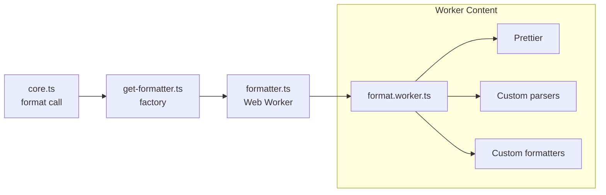

# Code Formatting System

This guide describes the code formatting system in LiveCodes, located in `src/livecodes/formatter/`.

## Overview

LiveCodes uses [Prettier](https://prettier.io/) as the primary code formatter, with support for custom formatters for languages not supported by Prettier. Formatting runs in a Web Worker to avoid blocking the main UI thread.

## Architecture



## Formatter Interface

```typescript
interface Formatter {
  load: (languages: Language[]) => Promise<string>;
  getFormatFn: (language: Language) => Promise<FormatFn>;
  destroy: () => void;
}

interface FormatFn {
  (value: string, cursorOffset: number, formatterConfig?: Partial<FormatterConfig>): Promise<{
    formatted: string;
    cursorOffset?: number;
  }>;
}
```

`cursorOffset` in the result is optional:

- Prettier formatters return it via `prettier.formatWithCursor`.
- wasm-fmt formatters return only `{ formatted }`.
- clang-format may return a negative offset (`-1`) when it cannot determine a position.

Consumers must therefore treat a missing or negative offset as `0`. Both CodeMirror and CodeJar clamp identically:

```typescript
const newOffset =
  newValue.cursorOffset != null && newValue.cursorOffset >= 0 ? newValue.cursorOffset : 0;
```

## Formatter Types

### 1. Prettier-based Formatters

Most languages use Prettier with language-specific parsers:

```typescript
// lang-html.ts
export const html: LanguageSpecs = {
  name: 'html',
  formatter: {
    prettier: {
      name: 'html',
      pluginUrls: [parserPlugins.html],
    },
  },
  // ...
};
```

**Parser Plugin URLs** are defined in `src/livecodes/languages/prettier.ts`:

```typescript
export const parserPlugins = {
  html: '{{hash:prettier-plugin-html.js}}',
  babel: '{{hash:prettier-plugin-babel.js}}',
  typescript: '{{hash:prettier-plugin-typescript.js}}',
  // ... more parsers
};
```

`PrettierParser.pluginUrls` is optional. A parser whose plugin is self-registering can omit it entirely:

```typescript
prettier: {
  name: 'custom',
  // no pluginUrls
}
```

For plugins that must be loaded lazily (e.g. because they only work in a worker context), `prettier` can also be a function that returns a parser synchronously or asynchronously. The function is called by the worker on first use:

```typescript
prettier: () => ({
  name: 'custom',
  plugins: [(self as any).customPlugin],
})
```

### 2. Custom Formatters

Languages without Prettier support use custom formatters:

```typescript
// lang-go.ts
export const go: LanguageSpecs = {
  name: 'go',
  formatter: {
    factory: () => {
      importScripts(go2jsBaseUrl + 'go2js-format.js');
      return async (code: string) => {
        const [formatted, err] = (globalThis as any).go2jsFormat(code);
        if (err) return { formatted: code, cursorOffset: 0 };
        return { formatted, cursorOffset: 0 };
      };
    },
  },
  // ...
};
```

The `factory` may also be `async` and return a `Promise<FormatFn>`. This is how the WebAssembly-based formatters load their runtime: they dynamically `import()` a module from a CDN, initialize it, then return the formatting function. Dynamic `import()` works inside the classic formatting worker and the URL is left untouched by the bundler.

```typescript
// lang-cpp.ts
import { wasmFmtClangBaseUrl } from '../../vendors';

export const cpp: LanguageSpecs = {
  name: 'cpp',
  formatter: {
    factory: async () => {
      const formatter = await import(wasmFmtClangBaseUrl + 'clang-format-web.js');
      await formatter.default();
      return async (code) => ({ formatted: await formatter.format(code, 'main.cpp', 'Google') });
    },
  },
  // ...
};
```

When two languages share the same formatter (e.g. `python` and `python-wasm`), export the formatter object from one spec and reuse it in the other instead of duplicating the factory:

```typescript
// lang-python-wasm.ts
import { wasmFmtRuffBaseUrl } from '../../vendors';

export const pythonFormatter: LanguageSpecs['formatter'] = {
  factory: async () => {
    const formatter = await import(wasmFmtRuffBaseUrl + 'ruff_fmt_web.js');
    await formatter.default();
    return async (code) => ({ formatted: await formatter.format(code, 'main.py') });
  },
};
```

### 3. Fake Formatter

Used when formatting is disabled:

```typescript
function createFakeFormatter(): Formatter {
  return {
    load: () => Promise.resolve('do nothing'),
    getFormatFn: () => Promise.resolve((value, cursorOffset) => 
      Promise.resolve({ formatted: value, cursorOffset })),
    destroy: () => undefined,
  };
}
```

---

## Formatter Factory

The `getFormatter` factory creates the appropriate formatter:

```typescript
export const getFormatter = (config: Config, baseUrl: string, lazy: boolean): Formatter => {
  const { readonly, mode } = config;

  if (readonly || mode === 'codeblock' || mode === 'result') {
    return createFakeFormatter();  // No formatting needed
  } else if (lazy) {
    return createLazyFormatter(baseUrl);  // Defer loading
  } else {
    return createFormatter(baseUrl);  // Full formatter with worker
  }
};
```

**Lazy Formatter** defers worker creation until first use:

```typescript
const createLazyFormatter = (baseUrl: string) => {
  let formatter = createFakeFormatter();
  
  const lazyFormatter = {
    load: (languages) => {
      loadFormatter();
      return formatter.load(languages);
    },
    getFormatFn: (language) => {
      loadFormatter();
      return formatter.getFormatFn(language);
    },
    destroy: () => { /* ... */ },
  };
  
  const loadFormatter = () => {
    formatter = createFormatter(baseUrl);  // Create real formatter
  };
  
  return lazyFormatter;
};
```

---

## Worker Communication

Messages between main thread and worker:

| Message Type | Direction | Purpose |
|--------------|-----------|---------|
| `init` | Main → Worker | Initialize with base URL |
| `load` | Main → Worker | Load formatters for languages |
| `loaded` | Worker → Main | Confirm load success |
| `load-failed` | Worker → Main | Load failure |
| `format` | Main → Worker | Request formatting |
| `formatted` | Worker → Main | Formatted result |
| `format-failed` | Worker → Main | Format failure |

---

## Worker Implementation

`format.worker.ts` runs in a dedicated Web Worker:

### Loading Parsers and Formatters

Parsers and custom formatters are cached as **promises**, so concurrent requests share a single load:

```typescript
const parsers: { [key: string]: Promise<PrettierParser> } = {};
const formatters: { [key: string]: Promise<FormatFn> } = {};

const loadPrettier = () => {
  importScripts(prettierUrl);
};

const loadParser = async (language: Language): Promise<PrettierParser | undefined> => {
  if (!(self as any).prettier) {
    loadPrettier();
  }
  if (language in parsers) {
    return parsers[language];
  }

  const parser = getParser(language);
  if (!parser) return;

  if (!(self as any).prettierPlugins) {
    (self as any).prettierPlugins = {};
  }

  let parserPromise: Promise<PrettierParser> | undefined;

  if (typeof parser === 'function') {
    parserPromise = Promise.resolve(parser());
  } else if (parser.pluginUrls && parser.pluginUrls.length > 0) {
    parser.plugins = parser.pluginUrls
      .map((pluginUrl) => {
        if (plugins[pluginUrl]) return true;
        try {
          importScripts(pluginUrl);
          plugins[pluginUrl] = true;
          return true;
        } catch (err) {
          console.warn('Failed to load formatter for: ' + language);
          return false;
        }
      })
      .filter(Boolean);
    parserPromise = Promise.resolve(parser);
  }

  if (!parserPromise) return;
  parsers[language] = parserPromise;
  try {
    return await parsers[language];
  } catch (error) {
    delete parsers[language];
    throw error;
  }
};
```

`loadParser` handles the three parser shapes (a static `PrettierParser`, a parser factory function, or a parser with no `pluginUrls`) and skips plugins that were already loaded via `importScripts`. `loadFormatter` invokes the language's `factory`:

```typescript
const loadFormatter = async (language: Language): Promise<FormatFn | undefined> => {
  if (language in formatters) {
    return formatters[language];
  }

  const formatter = getFormatter(language);
  if (!formatter || !('factory' in formatter)) return;

  formatters[language] = Promise.resolve(formatter.factory(baseUrl, language));
  try {
    return await formatters[language];
  } catch (error) {
    delete formatters[language];
    throw error;
  }
};
```

The promise is stored **before** the first `await`, so when an idle preload races a `format` request the `factory` runs only once. On failure the cache entry is deleted so a later retry re-runs the factory.

The worker's `load` handler triggers loading for a set of languages without blocking; failures are logged and left to retry:

```typescript
const load = (languages: Language[]) => {
  languages.forEach((language) => {
    if (getParser(language) != null) {
      loadParser(language);
    } else if (getFormatter(language) != null) {
      loadFormatter(language).catch(() => {
        console.warn('Failed to load formatter for: ' + language);
      });
    }
  });
};
```

### Formatting

```typescript
const format = async (
  language: Language,
  value: string,
  cursorOffset: number,
  formatterConfig: Partial<FormatterConfig>,
) => {
  if (getParser(language) != null) {
    // Prettier-based formatting
    const parser = await loadParser(language);
    return (self as any).prettier.formatWithCursor(value, {
      parser: parser?.name,
      plugins: prettierPlugins,
      cursorOffset,
      ...formatterConfig,
    });
  }

  if (getFormatter(language) != null) {
    // Custom formatter
    const formatFn = await loadFormatter(language);
    return formatFn?.(value, cursorOffset);
  }

  return { formatted: value, cursorOffset };
};
```

### Wasm-based Formatters

Several languages format using WebAssembly-compiled formatters from the [`wasm-fmt`](https://github.com/wasm-fmt) project. Their base URLs live in `src/livecodes/vendors.ts`:

| Vendor constant | Package | Used by |
|-----------------|---------|---------|
| `wasmFmtClangBaseUrl` | `@wasm-fmt/clang-format` | C++, C++ (Wasm), C# (Wasm), Java |
| `wasmFmtRuffBaseUrl` | `@wasm-fmt/ruff_fmt` | Python, Python (Wasm) |
| `wasmFmtZigBaseUrl` | `@wasm-fmt/zig_fmt` | Zig (Wasm) |

Each factory follows the same contract: dynamically `import()` `<baseUrl><name>_web.js`, `await` its default export to initialize the WASM runtime, then return a function that delegates to the module's `format` method. clang-format takes a filename and a style (`'Google'` for C++/Java, `'Microsoft'` for C#), while `ruff_fmt` and `zig_fmt` take only the source (and a filename for Ruff). The `_web.js` init resolves its `.wasm` sibling relative to `import.meta.url` and fetches it with a graceful fallback when the MIME type is not `application/wasm`, so no extra wasm-path wiring is needed.

---

## Formatter Configuration

User-configurable options via `FormatterConfig`:

```typescript
interface FormatterConfig {
  useTabs: boolean;
  tabSize: number;
  semicolons: boolean;
  singleQuote: boolean;
  trailingComma: boolean;
}
```

Defaults from `defaultConfig`:

```typescript
useTabs: false,
tabSize: 2,
semicolons: true,
singleQuote: true,
trailingComma: 'all',
```

---

## Usage in core.ts

### Initialization

```typescript
formatter = getFormatter(getConfig(), baseUrl, isEmbed);
```

### Loading Formatters

```typescript
// Called when language changes or on initial load
formatter.load(getEditorLanguages());
```

### Formatting Code

```typescript
const format = async (allEditors = true) => {
  if (allEditors) {
    await Promise.all(
      Object.values(editors).map(async (editor) => {
        await editor.format();
        if (getConfig().foldRegions) {
          await editor.foldRegions?.();
        }
      }),
    );
  } else {
    const activeEditor = getActiveEditor();
    await activeEditor.format();
  }
  updateConfig();
};
```

### Registering Formatter with Editor

```typescript
// When creating editors
formatter.getFormatFn(language).then((fn) => {
  editor.registerFormatter(fn);
});

// On language change
formatter.getFormatFn(language).then((fn) => {
  editor.registerFormatter(fn);
});
```

---

## Editor Integration

Editors call `format()` which uses the registered formatter:

```typescript
// monaco.ts
const format = async () => {
  editor.getAction('editor.action.formatDocument')?.run();
};

// codemirror.ts
const format = async () => {
  if (!formatter) return;
  const offset = view.state.selection.main.to;
  const oldValue = getValue();
  const newValue = await formatter(oldValue, offset, getFormatterConfig());
  setValue(newValue.formatted, false);
  const newOffset =
    newValue.cursorOffset != null && newValue.cursorOffset >= 0 ? newValue.cursorOffset : 0;
  view.dispatch({ selection: { anchor: newOffset } });
};

// codejar.ts
const format = async () => {
  if (!formatter) return;
  const position = codejar?.save();
  const offset = position?.start || 0;
  const oldValue = getValue();
  const newValue = await formatter(oldValue, offset, getFormatterConfig());
  setValue(newValue.formatted);
  const newOffset =
    newValue.cursorOffset != null && newValue.cursorOffset >= 0 ? newValue.cursorOffset : 0;
  codejar?.restore({ start: newOffset, end: newOffset });
};
```

---

## Language Spec Formatter Definition

A `LanguageSpecs.formatter` is either a Prettier parser or a custom factory:

### Prettier Parser

```typescript
formatter: {
  prettier: {
    name: 'typescript',           // Parser name
    pluginUrls: [                 // Optional (omit when the plugin self-registers)
      parserPlugins.typescript,   // Parser plugin
      parserPlugins.estree,       // Additional plugins
    ],
  },
}
```

`prettier` may instead be a function that returns a `PrettierParser` (or a promise for one), called lazily by the worker:

```typescript
formatter: {
  prettier: () => ({
    name: 'custom',
    plugins: [(self as any).customPlugin],
  }),
}
```

### Custom Formatter Factory

The factory receives the app `baseUrl` and the `Language` and returns a `FormatFn` or a `Promise<FormatFn>`:

```typescript
formatter: {
  factory: (baseUrl: string, language: Language) => async (code: string) => {
    // Custom formatting logic
    return { formatted: code, cursorOffset: 0 };
  },
}
```

A factory can also be `async` to load a runtime before returning the `FormatFn`:

```typescript
formatter: {
  factory: async () => {
    const formatter = await import(wasmFmtClangBaseUrl + 'clang-format-web.js');
    await formatter.default();
    return async (code: string) => ({ formatted: await formatter.format(code, 'main.cpp', 'Google') });
  },
}
```

---

## Adding a New Formatter

1. **Prettier-supported language:**
   ```typescript
   // src/livecodes/languages/your-lang/lang-your-lang.ts
   export const yourLang: LanguageSpecs = {
     name: 'your-lang',
     formatter: {
       prettier: {
         name: 'your-lang',
         pluginUrls: [parserPlugins.yourLang],
       },
     },
     // ...
   };
   ```

2. **Custom formatter:**
   ```typescript
   formatter: {
     factory: (baseUrl) => {
       // Load your formatter library
       importScripts(baseUrl + 'your-formatter.js');
       return async (code) => {
         const formatted = customFormat(code);
         return { formatted, cursorOffset: 0 };
       };
     },
   }
   ```

3. **Wasm-based custom formatter:**
   Add a vendor base URL in `src/livecodes/vendors.ts` (with `getUrl`), then load the module dynamically and initialize it in an `async` factory:
   ```typescript
   formatter: {
     factory: async () => {
       const formatter = await import(wasmFmtYourBaseUrl + 'your-web.js');
       await formatter.default();
       return async (code) => ({ formatted: await formatter.format(code) });
     },
   }
   ```
   Add the third-party license to `vendor-licenses.md` and document the formatter on the language's `docs/docs/languages/<lang>.mdx` page.

---

## Performance Considerations

- **Web Worker:** Formatting runs off main thread
- **Lazy Loading:** Formatter loaded only when needed
- **Fake Formatter:** Skipped completely in readonly/codeblock modes
- **Prettier Lazy Load:** Prettier loaded only when first format needed
- **Promise Cache:** Parser and formatter loads are cached as promises; concurrent requests share a single load and a failed load is evicted so it can be retried