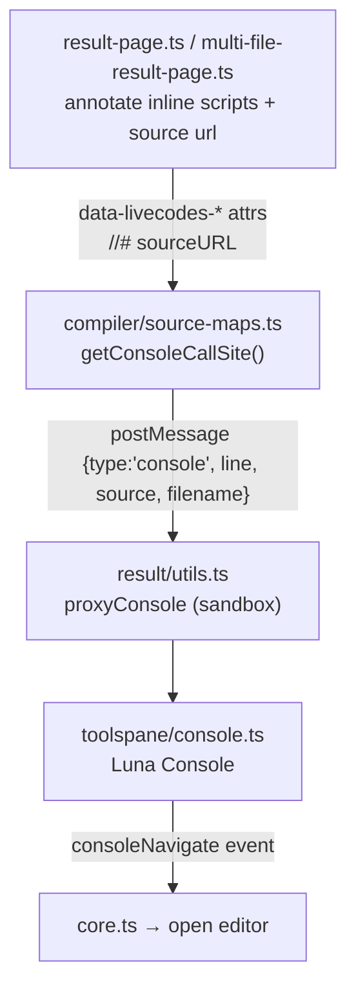

# Source Maps & Console Line Numbers

This guide explains how LiveCodes maps a log/error reported by the result page back to the
source file and line that produced it, so the console badge shows a correct, clickable
location. It covers the data pipeline, single-file versus multi-file behavior, and how each
layer is tested.

## Overview

When user code runs, `console.log`/`console.error` output is relayed from the sandboxed result
iframe to the parent app and rendered by the Console tool. Each console entry can carry a
**source badge** (e.g. `script:7`, `markup:16`, `index.html:10`, or `main.js:2`) that, when
clicked, navigates the editor to that file and line.

Three pieces work together to produce a badge:

1. **The result page** (`result/`) annotates inline scripts and records per-file source maps.
2. **The sandbox resolver** (`compiler/source-maps.ts`) inspects the current stack frame to
   decide *which* source a log belongs to and computes a line.
3. **The console tool** (`toolspane/console.ts`) chooses the right source map by key and renders
   the badge.

The line numbers are only computed when the console is enabled and the result is not being
exported.

## Architecture



## The stack frame is not directly usable

The result iframe receives its content through a `message-script` that calls `document.open()`
/ `document.write()`. As a consequence, **every inline `<script>` (classic and `type="module"`)
reports a collapsed stack-frame location** — a small, page-dependent document line/column
(observed as variations like `2:11` or `3:11`). The frame line therefore cannot be used on its
own to find the original editor line.

Instead, the resolver uses a combination of:

- the **raw frame `docLine`** for scripts (it increases one line per editor line *within* a
  script, so it preserves per-line granularity), and
- **explicit annotations** baked by the result page for inline and multi-file scripts, which
  carry the precise editor/file line and survive the collapse.

## Source maps & `CompileInfo.sourceMaps`

Compilers that produce source maps (e.g. TypeScript) return them through `CompileInfo.sourceMaps`,
a record keyed by **filename**:

```typescript
interface CompileInfo {
  sourceMaps?: Record<string, string>; // { "script": "...", "tax-calculator.ts": "..." }
}
```

- **Single-file**: the key is `'script'`.
- **Multi-file**: each compiled script file is a key (`src/main.ts`, `src/counter.js`, …).

The result page appends a `//# sourceURL=<filename>` and a `//# sourceMappingURL=<data url>` to
each injected script so the browser resolves frames by filename and reprovides the map.

`core.ts` merges discovered maps and hands them to the console via `console.setSourceMap(...)`:

- `null` → plain JavaScript (raw lines are correct).
- `undefined` → languages with no meaningful line (Python, Ruby, WASM) → badges disabled.
- a record → compiled languages → badges + line mapping.

## Console call-site resolution (`compiler/source-maps.ts`)

`getConsoleCallSite()` (for `console.*` calls) and `getConsoleCallSiteFromError()` (for
uncaught errors) both:

1. pick a **candidate frame** from `Error().stack`,
2. extract the frame's `:line:column`,
3. call `resolveConsoleCallSiteFromDocLine(...)` to decide the source.

### Source selection

The resolver reads document flags that the result page sets on `<body>`:

| Flag | Set by | Meaning |
| ---- | ------ | ------- |
| `data-livecodes-markup-line-offset` | single- & multi-file result pages | body-content start line |
| `data-livecodes-script-line-offset` | single-file result page | compiled editor-script start line |
| `data-livecodes-multi-file` | multi-file result page | multi-file mode |
| `data-livecodes-main-file` | multi-file result page | main file name, e.g. `index.html` |

The resolution order is:

1. **Multi-file, frame names a file** (via `data-livecodes-main-file` + `sourceURL`): report
   `filename` = the file, source `'script'`.
2. **Multi-file inline script** (no `sourceURL`): report `filename` = the main file, using the
   file-relative line annotated on the script.
3. **Single-file, external/data-URL frame**: `source: 'script'`.
4. **Single-file, inline markup script**: `source: 'markup'`.
5. Otherwise: fall back to the document-offset math used before.

### Inline script line recovery

Inline scripts (classic or module) are the hardest case because their frame collapses. The
result page marks each inline `<script>` with:

- `data-livecodes-markup-script-line` — the editor line where the script's content begins
  (script tag line + 1 when the content starts on a new line).
- `data-livecodes-markup-script-stack-base` — a normalization constant (`1`/`2`) that makes the
  collapsed `docLine` relative to the script start.

For classic inline scripts (`document.currentScript` is set), the resolver computes:

```typescript
contentStartLine + docLine - stackBase;
```

This yields the correct per-log line *and* preserves distinct lines for multiple logs inside one
script. Because `docLine` is not a stable absolute value across page layouts, the resolver must
**not** return the baked line alone — that would collapse every log in a script to the same
content-start line.

For `type="module"` inline scripts, `document.currentScript` is `null` while they run immediately
(top-level). The result page prepends a low-cost prologue that records the module's file-relative
start line onto `<body>` (`data-livecodes-current-markup-script-line`); the resolver reads it when
`currentScript` is unavailable.

## Console badge rendering (`toolspane/console.ts`)

The console receives each message with the sandbox-computed `source`, `lineNumber`,
`columnNumber`, and (multi-file) `filename`, then picks a source-map key and renders the badge:

```typescript
const mapKey = messageFilename ?? (hasMap && source !== 'markup' ? firstKey ?? 'script' : undefined) ?? source;
```

- `messageFilename` wins when present (multi-file) — it has its own source map, or the raw line is
  already correct for plain `.js`.
- Otherwise the first source-map key is used **only for script sources**; `markup` call sites are
  never remapped through a script source map (a key correctness rule, guarded by
  `source !== 'markup'`).
- Mapping is applied through `getOriginalPosition` / `getSourceLineMap` (decoded with an in-house
  VLQ decoder in `compiler/source-maps.ts`).

Clicking a badge dispatches `customEvents.consoleNavigate` with `editorId`, `line`, and `column`;
`core.ts` opens that editor file at the location.

## How to add or verify line numbers

When modifying this system, keep these invariants in mind:

- **Single-file JavaScript** (no source map) shows the raw line: `script:<line>`.
- **Single-file compiled** (source map present) maps compiled → original through the `script` map.
- **Single-file inline markup** stays `markup:<line>` even when the script has a source map.
- **Multi-file** reports the **filename** and its **file-relative** line:
  - main-file inline scripts → `index.html:<line>`,
  - imported/compiled script files → `src/main.js:<line>`, `src/main.ts:<line>`.

### Caveats

- Multi-file inline lines are computed against the **original main-file content** (before
  LiveCodes appends its own `<head>` scripts), so the numbers match the editor.
- The raw frame `docLine` is unstable across page layouts; do not build logic on an absolute
  collapsed value.

## Persisted regression tests

Behavior is pinned by both unit and end-to-end tests:

- `src/livecodes/compiler/__tests__/source-maps.spec.ts` — the source-map decoder and the
  call-site resolver (multi-file filename detection, main-file inline scripts, single-file
  offsets). Run with:

  ```bash
  npm run test:unit -- --testPathPattern=source-maps
  ```

- `e2e/specs/console-line-logs.spec.ts` — end-to-end badges for single-file (JS/TS × inline
  classic, inline module, script) and multi-file (JS/TS × main-file inline classic, inline module,
  script file). Multi-file projects are opened via the SDK:

  ```typescript
  const url = getPlaygroundUrl({ appUrl: getTestUrl(), config: { files, mainFile: 'index.html' } });
  ```

  Run with:

  ```bash
  npm run e2e -- --grep "Console line logs"
  ```

## Related

- [`result-page.mdx`](./result-page.mdx) — result iframe generation and the sandbox iframe.
- [`tools-pane-system.mdx`](./tools-pane-system.mdx) — the Console tool and message protocol.
- [`compiler-system.mdx`](./compiler-system.mdx) — the compilation pipeline and `CompileInfo`.
