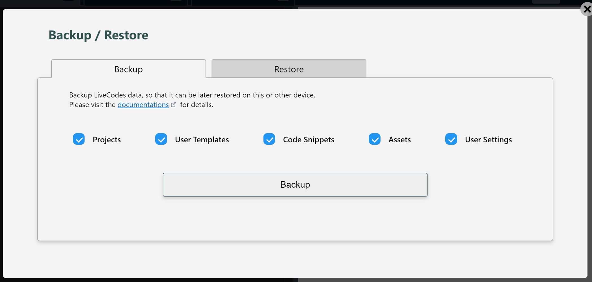

# Backup / Restore

LiveCodes data can be backed-up, so that it can be later restored on the same or different device.

The Backup/Restore screen can be accessed from the app menu → Backup / Restore.

import RunInLiveCodes from '../../src/components/RunInLiveCodes.tsx';

<RunInLiveCodes params={{screen: 'backup'}} linkText="direct link" />

## Backup

The backup can include one or more of the following:

- [Projects](./projects.md)
- [User Templates](./templates.md)
- [Code Snippets](./snippets.md)
- [Assets](./assets.md)
- [User Settings](./user-settings.md)

A zip file containing the (base64-encoded binary) backup data is downloaded. This file can be restored later on the same or different device.

## Restore

When restoring a backup, there are 2 options for managing the current data:

1. The current data can be deleted and replaced by the backup data. It cannot then be retrieved, so you may want to back it up first.

2. The backup data can be merged with the current data with best effort to preserve both.

## Related

- [Sync](./sync.md)
- [Export](./export.md)
