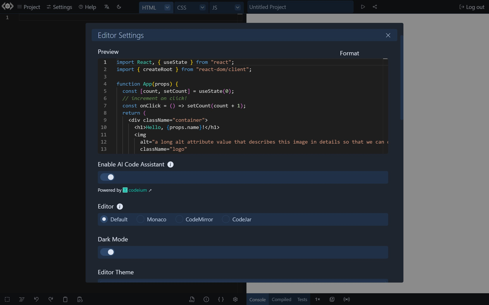
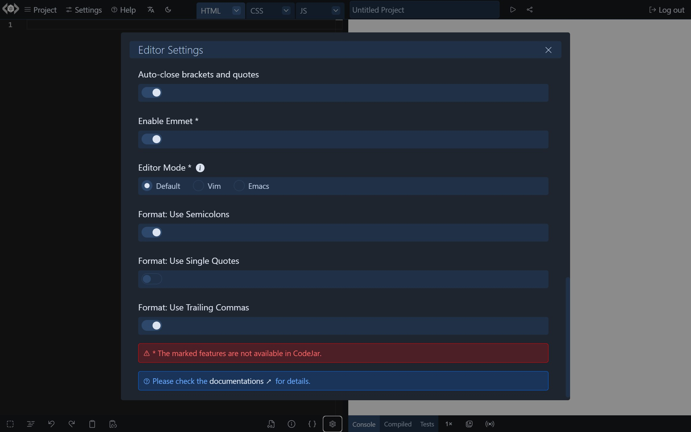

# Editor Settings

LiveCodes allows a lot of flexibility for configuring which code editor to use and its settings.

`Editor Settings` screen can be accessed from Settings menu → Editor Settings.

import RunInLiveCodes from '../../src/components/RunInLiveCodes.tsx';

<RunInLiveCodes params={{ screen: 'editor-settings' }} linkText="direct link" />

A preview code editor is displayed to preview the settings in real time.

The settings selected in the `Editor Settings` screen are saved locally to [user settings](./user-settings.mdx) and are used subsequently. These include:
{/*
### Enable AI Code Assistant

Enables the [AI code assistant](./ai.mdx). (Free and no account required)
 */}

### Code Editor

The following code editors are supported:

- [**Monaco Editor**](https://microsoft.github.io/monaco-editor/): This is the code editor that powers [**VS Code**](https://code.visualstudio.com/). It is [feature-rich](https://code.visualstudio.com/docs/editor/codebasics) and supports autocomplete with [**IntelliSense**](https://code.visualstudio.com/docs/editor/intellisense) (including [types for custom libraries](./intellisense.mdx)). However, it requires a relatively large download and is not supported in mobile browsers.
- [**CodeMirror**](https://codemirror.net/): Has [many editing features](https://codemirror.net/docs/extensions/), including autocomplete, with good **mobile support**.
- [**CodeJar**](https://medv.io/codejar/): A **lightweight** code editor with very basic editing features. [PrismJs](https://prismjs.com/) is used for syntax highlighting. Please note that some editor settings are not supported in CodeJar (see below).

This can be configured using the [`editor`](../configuration/configuration-object.mdx#editor) configuration option.

By default, Monaco editor is used on desktop, CodeMirror is used on mobile and CodeJar is used in [codeblocks](./display-modes.mdx#codeblock), in [lite mode](./lite.mdx) and in [readonly](../configuration/configuration-object.mdx#readonly) playgrounds.

### Editor Options

These include:

- [Editor theme](../configuration/configuration-object.mdx#editortheme)
- [Font family](../configuration/configuration-object.mdx#fontfamily)
- [Font size](../configuration/configuration-object.mdx#fontsize)
- [Indentation](../configuration/configuration-object.mdx#usetabs) (Spaces/Tabs)
- [Tab size](../configuration/configuration-object.mdx#tabsize)
- [Line numbers](../configuration/configuration-object.mdx#linenumbers)
- [Word-wrap](../configuration/configuration-object.mdx#wordwrap)
- [Auto-close brackets and quotes](../configuration/configuration-object.mdx#closebrackets)
- [Fold (collapse) regions](../configuration/configuration-object.mdx#foldregions)

### Emmet

Allows using [**Emmet**](https://emmet.io/) [abbreviations and actions](https://docs.emmet.io/). See [`emmet`](../configuration/configuration-object.mdx#emmet) configuration option.

(Not supported in CodeJar)

### Editor Modes

Allows using [**Vim**](https://vimhelp.org/) and [**Emacs**](https://www.gnu.org/software/emacs/manual/html_node/emacs/Basic.html) keyboard bindings. See [`editorMode`](../configuration/configuration-object.mdx#editormode) configuration option.

(Not supported in CodeJar)

### Format Options

These are [**Prettier**](https://prettier.io/) [configuration options](https://prettier.io/docs/en/options.html) used for code formatting.

In addition to those specified in [Editor Options](#editor-options), the following options are available:

- [Use Semicolons](../configuration/configuration-object.mdx#semicolons)
- [Use Single Quotes](../configuration/configuration-object.mdx#singlequote)
- [Use Trailing Commas](../configuration/configuration-object.mdx#trailingcomma)
