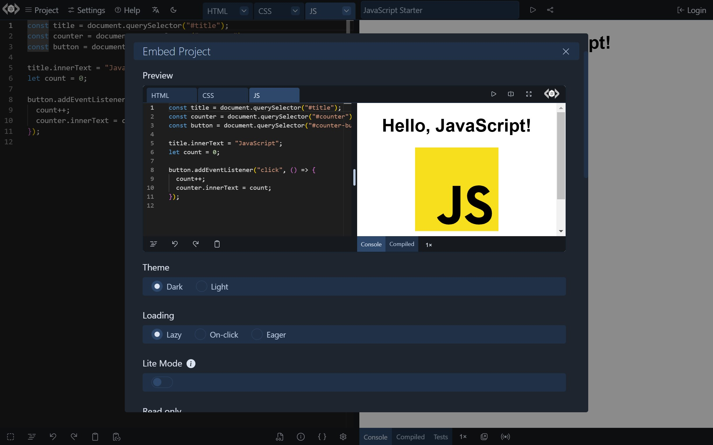

# Embedded Playgrounds

import LiveCodes from '../../src/components/LiveCodes.tsx';

## Overview

LiveCodes playgrounds can be embedded in any web page. The playground can be [prefilled with code](./code-prefill.mdx) in any supported language. This can be very useful in documentation websites, technical blogs, educational websites and others.

Demo:

<LiveCodes template="javascript"></LiveCodes>

The embedding web page can communicate with the playground using a powerful [SDK](../sdk/index.mdx) (e.g. edit/format code, watch for code changes, get the compiled code or result page HTML, run tests, change layout, ...etc).

## Create Embedded Playground

### App Embed Screen

In the [standalone app](../getting-started.mdx#standalone-app), the Embed Screen can be accessed from Project menu → Embed.

import RunInLiveCodes from '../../src/components/RunInLiveCodes.tsx';

<RunInLiveCodes params={{ screen: 'embed' }} linkText="direct link" />

It shows a preview of the embedded playground, allows customizations of [embed options](../sdk/js-ts.mdx#embed-options) and provides generated code that can be added to the web page that will embed the playground.

:::info Note

Please note that the Embed Screen sends the project code to [LiveCodes share service](./share.mdx) to generate a short URL for usage in the embed code.

:::

The setting "Embed Type" allows selection from different variations of the generated code:

- Using the SDK from CDN.
- Using the SDK with a bundler (e.g. vite, parcel, webpack, etc).
- Using the React SDK.
- Using the Vue SDK.
- Using iframe and [query params](../configuration/query-params.mdx).
- Using HTML code that the SDK can use to [auto-prefill](./code-prefill.mdx#auto-prefill-from-page-dom) the playground.

### SDK

The LiveCodes [SDK](../sdk/index.mdx) can be used to embed playgrounds, specify [embed](../sdk/js-ts.mdx#embed-options) and [configuration](../configuration/index.mdx) options and allows communication with the embedded playground with many [SDK methods](../sdk/js-ts.mdx#sdk-methods).

This method provides more control and allows advanced scenarios.

## Avoid Breaking Changes

To avoid breaking changes that would cause the embedded playgrounds to stop working as expected with later updates, follow these recommendations:

- Use a [permanent URL](./permanent-url.mdx) to a pinned version of the LiveCodes app for [`EmbedOptions.appUrl`](../sdk/js-ts.mdx#appurl). The code generated in the Embed screen uses that by default.
- Specify the version of the SDK used. The code generated in the Embed screen also does that.
- For project code, [specify the versions](./module-resolution.mdx#package-version) of the imported packages and [external resources](./external-resources.mdx). [Custom import maps](./module-resolution.mdx#custom-module-resolution) can be set to control the module import behavior.

Check the [Permanent URL](./permanent-url.mdx) section for more details.

## Differences from Full App

Some of the features of the full standalone app are not available or shown by default in embedded playgrounds, either because of security reasons, being not useful when embedded or because of space limitations.

### Features Not Available

- All features that require saving/loading from browser storage:
  e.g. [projects](./projects.mdx), [assets](./assets.mdx), [code snippets](./snippets.mdx), [user settings](./user-settings.mdx), [default template/language](./default-template-language.mdx), [recover unsaved](./recover.mdx), [backup/restore](./backup-restore.mdx).
- All features that require authentication:
  e.g. [login/logout](./github-integration.mdx), [sync](./sync.mdx), [deploy](./deploy.mdx), [importing](./import.mdx) from private github repos.
- [Broadcast](./broadcast.mdx).
- App menus.
- Some tools in [tools pane](./tools-pane.mdx):
  e.g. open result page in new window, broadcast status.
- [Welcome screen](./welcome.mdx).

### Features Not Shown by Default

- [External resources](./external-resources.mdx) button (below the editor) and external resources screen are only shown if the loaded project has external resources (e.g. via [`EmbedOptions.config.stylesheets`](../configuration/configuration-object.mdx#stylesheets) and [`EmbedOptions.config.scripts`](../configuration/configuration-object.mdx#scripts)).
- [Tests](./tests.mdx) are not shown in [tools pane](./tools-pane.mdx) unless the loaded project has tests (e.g. via [`EmbedOptions.config.tests`](../configuration/configuration-object.mdx#tests)). Test editor is not available.
- Loading [starter templates](./templates.mdx) can be achieved by the [SDK](../sdk/index.mdx) ([`EmbedOptions.template`](../sdk/js-ts.mdx#template)), not from the UI.
- [Importing](./import.mdx) from external sources can be achieved by the [SDK](../sdk/index.mdx) ([`EmbedOptions.import`](../sdk/js-ts.mdx#import)), not from the UI.
- Getting a [share](./share.mdx) URL can be achieved by the [SDK](../sdk/index.mdx) ([`getShareUrl`](../sdk/js-ts.mdx#getshareurl) method), not from the UI.

## Security

- All user code, [result page](./result.mdx) and compilers run in [sandboxed iframes](https://www.html5rocks.com/en/tutorials/security/sandboxed-iframes/) with a unique origin.

- Embedded playgrounds do not have access to the parent page, or to sensitive data like user cookies and localstorage of the embedding page origin. Communications with the SDK occur by means of [`postMessage`](https://developer.mozilla.org/en-US/docs/Web/API/Window/postMessage) calls.

## Related

- [SDK](../sdk/index.mdx)
- [Code prefill](./code-prefill.mdx)
- [Configuration](../configuration/index.mdx)
- [Embed options](../sdk/js-ts.mdx#embed-options)
- [SDK methods](../sdk/js-ts.mdx#sdk-methods)
- [Permanent URL](./permanent-url.mdx)
- [Lite mode](./lite.mdx)
- [Read-only](./read-only.mdx)
