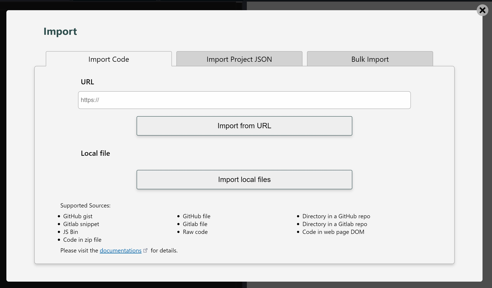

# Import

## Overview

LiveCodes supports importing code from a wide variety of sources.

The Import screen can be accessed from the settings menu → Import.



Alternatively, a URL of any of the sources can be imported on-load by adding it as a value to query string key: `x`, for example:

https://livecodes.io/?x=https://gist.github.com/f01deb828a42f363502fbae7964d48e9

## Sources

Import is supported from any of the following:

- GitHub gist
- GitHub file
- Directory in a GitHub repo
- Gitlab snippet
- Gitlab file
- Directory in a Gitlab repo
- JS Bin
- [Shared projects](./share.md)
- Raw code
- Code in web page DOM
- Code in zip file
- [Exported project JSON](./export.md) (single project and bulk import)

Import sources are identified by URL patterns (e.g. origin, pathname and extension).

## File Selection

For sources that provide multiple files (e.g. GitHub/GitLab directories, GitHub gists, GitLab snippets and zip files), a best guess is tried to load files in respective editors. Best results are when there are 3 files and each file is in a language (identified by file extension) that can be loaded to a different editor, for example:

- index.html, style.css, script.js
- default.pug, app.scss, main.ts

Markup files starting with `index.`, style files starting with `style.` and script files starting with `script.` are given higher priority. While Markup files starting with `readme.` are given lower priority.

Alternatively, languages and files can be specified using [query params](../configuration/query-params.md):  
?x={url}&{language1}={file1}&{language2}={file2}&{language3}={file3}

## Import Shared Projects

[Shared Projects](./share.md) can be imported using the value of the query param `x` generated by the Share screen. This starts with either:

- `code/`: for compressed base64-encoded project config
- `id/`: for short URLs recognized by shared project id.

Example:

https://livecodes.io/?x=id/6ys2b8txf33

## Import Code from DOM

If the source URL does not match one of the supported origins (GitHub, GitLab and JS Bin), the URL is fetched, its response text is parsed as [DOM](https://developer.mozilla.org/en-US/docs/Web/API/Document_Object_Model) and code is extracted from elements that match specific CSS selectors.  
(By default: `.livecodes [data-lang="{language}"]`)

:::info Example

```html
<code class="livecodes">
  <pre data-lang="html">This is identified as &lt;strong&gt;HTML&lt;/strong&gt; code</pre>
</code>
```

The HTML editor is prefilled with: `This is identified as <strong>HTML</strong> code`

:::

Notice that the code should be html-encoded to avoid interference with the HTML of the page.

Example:

https://livecodes.io/?x=https://live-codes.github.io/livecodes-examples/prefill-from-code-blocks.html

Alternatively, custom CSS selectors can be specified using [query params](../configuration/query-params.md):  
?x={url}&{language}-selector={selector}.

The following example loads the content of the first element that matches the CSS selector `h3` as `html`:

https://livecodes.io/?html-selector=h3&x=https://live-codes.github.io/livecodes-examples/prefill-from-code-blocks.html

Of course, [embedded playgrounds](./embeds.md) can be prefilled with code from the same embedding page. This works well for documentation and educational websites.

[This is a demo](https://live-codes.github.io/livecodes-examples/prefill-from-code-blocks.html) for automatic extraction of code blocks to prefill editors by creating "Edit in LiveCodes" links. Also embedded editors are prefilled from the code blocks. ([View source](https://github.com/live-codes/livecodes-examples/blob/master/prefill-from-code-blocks.html))

## Import Raw Code

If the response text could not be parsed as DOM or no elements matched the CSS selectors, it is assumed to be raw code and the response text is loaded to editor. If the URL ends with an extension it is used to identify the language, otherwise it is assumed to be `html`.

Alternatively, the language of raw code can be specified using [query params](../configuration/query-params.md):  
?x={url}&raw={language}

## "Edit in LiveCodes" Bookmarklet

Instead of manually copy/pasting URLs to import, the bookmarklet can be very convenient. It opens LiveCodes in a new window and imports the current webpage URL.

drag this link to the browser bookmarks bar:

<a href="javascript:(()=>{window.open('https://livecodes.io/?x='+location.href,'_blank');})();">Edit in LiveCodes</a><br /><br />

or manually create a new bookmark in your browser and add this code as its URL:

```js
javascript: (() => {
  window.open('https://livecodes.io/?x=' + location.href, '_blank');
})();
```
