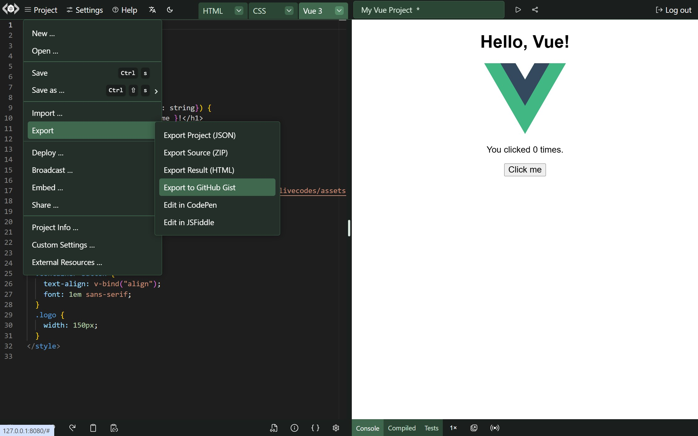
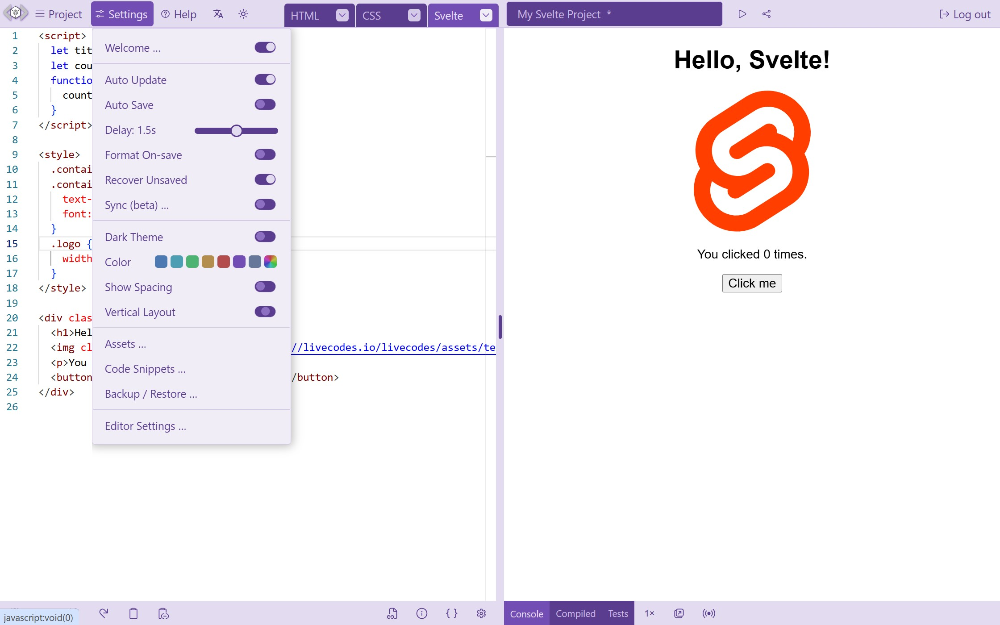
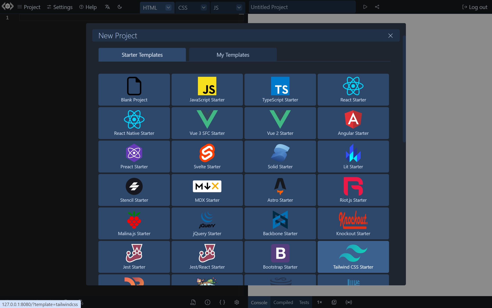

# Features

## Overview

_LiveCodes_ is an open-source, client-side, code playground that runs in the browser. It enables quick prototyping and experimenting with a wide variety of [technologies](../languages/index.mdx) (including 90+ languages, frameworks and processors) without having to manually setup a development environment for each. The [result](./result.mdx) is displayed as a regular web page. The rapid feedback of previewing the result page without waiting for build steps significantly boosts productivity.

In this page, a quick overview of the important features are presented. A more detailed description of each feature is described in the following sections.

## Powerful Editor

The default code editor is the powerful editor that powers [VS Code](https://code.visualstudio.com/), featuring code-completion, go-to-definition, multi-cursor support and other powerful features you got used to. The editor is very [customizable](./editor-settings.mdx). It supports [keyboard shortcuts](./keyboard-shortcuts.mdx), [code formatting](./code-format.mdx), [Emmet abbreviations](./editor-settings.mdx#emmet) and even [Vim and Emacs bindings](./editor-settings.mdx#editor-modes).

## Mobile-friendly

The responsive layout allows working on devices with different screen sizes. On mobile, a lighter-weight touch-friendly code editor (CodeMirror 6) is used, so that you can experiment your ideas on the go.

## External Code/Libraries

[External scripts/stylesheets](./external-resources.mdx) can be added to the web page. There is a UI screen that helps you search for and add NPM libraries and google fonts. Moreover, [NPM modules can be imported](./module-resolution.mdx) without the need for any `npm install`s.

## Import and Code Pre-fill

Code can be [imported](./import.mdx) from a variety of sources including GitHub gist, GitHub file, directory in a GitHub repo, Gitlab snippet, Gitlab file, directory in a Gitlab repo, JS Bin, raw code, code in web page DOM and code in zip file. You can also [pre-fill code](./code-prefill.mdx) using various ways.

## Share/Export

Projects can be easily [shared](./share.mdx) as URLs or QR codes. In addition, you may [export](./export.mdx) any project as HTML, JSON or zip file containing source code files. You may also export to other services like GitHub gists, CodePen or JSFiddle.

## Embed

Projects can be [embedded](./embeds.mdx) in any web page. The embed screen allows you to customize the embed options and preview the resulting playground. An easy-to-use, yet powerful, [SDK](../sdk/index.mdx), that allows [communication](../sdk/js-ts.mdx#sdk-methods) between the embedding page and the playground.

## Deploy

Projects can be [deployed](./deploy.mdx) to public URLs that can be shared with others. This is hosted for free on GitHub Pages.

## Starter Templates

A large number of [starter templates](./templates.mdx) are available. They can be used to get you started with most of the supported technologies.

## Assets

Your own local assets (e.g. images, icons, fonts, local scripts and stylesheets) can be added to the app and then used in any project. The assets are made available even when the projects are shared, exported or deployed.

## Dev Tools

[Tools](./tools-pane.mdx) like [console](./console.mdx), [compiled code viewer](./compiled-code.mdx) and [test runner](./tests.mdx) can significantly improve your development experience.

## Broadcast

You can [broadcast](./broadcast.mdx) source code or result in real-time to others. This can be of great value as an educational tool and for demo purposes.

## Sync/Backup/Restore

Do you work on multiple devices? No Problem! You may [sync](./sync.mdx), [backup and restore](./backup-restore.mdx) your data any time on any device.

## Themes

LiveCodes comes with dark and light themes. In addition, a theme color can be set to change the app color.

## i18n

LiveCodes supports [internationalization](./i18n.mdx) for multiple languages.

## Client-side!

LiveCodes runs in the browser, where all the processing/transpilation occurs, with no server rounds required. So, after the initial load, it becomes pretty fast. It can be hosted on any static file server or CDN. No `npm install`s. Just the browser!

## Developer-friendly

LiveCodes makes it easy to [get started](../getting-started.mdx). It is highly [configurable](../configuration/index.mdx). Lots of features can be configured by URL [query params](../configuration/query-params.mdx). The [SDK](../sdk/index.mdx) facilitates [embedding](./embeds.mdx) playgrounds and allows easy [communication](../sdk/js-ts.mdx#sdk-methods) with them. The SDK is available for use in [JS/TS](../sdk/js-ts.mdx), [React](../sdk/react.mdx) [Vue](../sdk/vue.mdx) and [Svelte](../sdk/svelte.mdx).

## Comprehensive Documentations

Rich documentations with screenshots, code samples and live demos are available. They cover the app [features](../features/index.mdx), [configuration](../configuration/index.mdx), [supported languages](../languages/index.mdx) and [SDK](../sdk/index.mdx) (including [TypeScript Types](../api/globals.md)). A gallery of usage examples is provided as a [storybook](pathname:///../stories).

## Focused on Privacy

Projects are private by default. The code you write in LiveCodes never leaves your computer, unless you choose to [share](./share.mdx), [export](./export.mdx), [broadcast](./broadcast.mdx) or [sync](./sync.mdx) it. User data is stored in the browser.

## Free and Open-Source

LiveCodes is free, with no limits for use and no ads.
No account is even required (unless [GitHub integration](./github-integration.mdx) is needed).
Do you want to [self-host](./self-hosting.mdx) it for commercial use? No problem! It is [MIT-licensed](../license.mdx) 🎉. Please consider [sponsoring LiveCodes](../sponsor.mdx) ❤.

This was a quick overview of the important features of LiveCodes. A more detailed description of each feature is described in the following sections.
