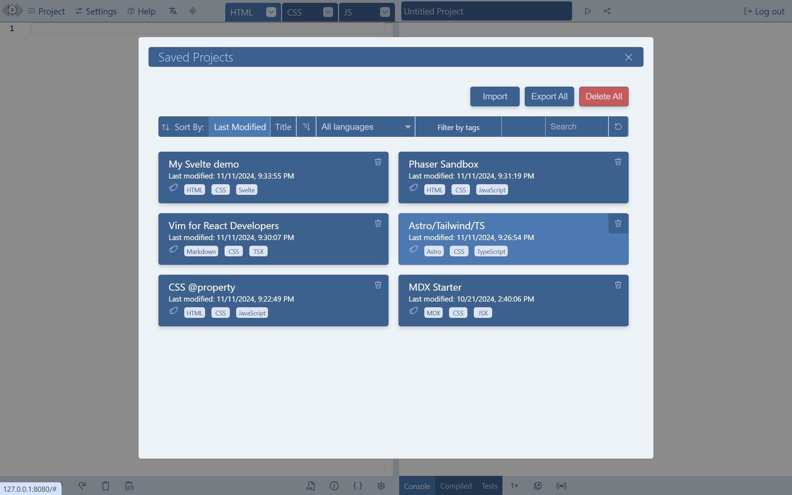

# Projects

A _LiveCodes_ project is a combination of markup, styles & scripts that result in a **single web page**. Check the section about the [Result Page](./result.mdx) to have more details about how this page is constructed.

There is no concept of file system or, for example, organizing multiple files in a directory structure of a single project.

:::info Simple Concept
code in [markup editor](#markup-editor) + code in [style editor](#style-editor) + code in [script editor](#script-editor) + [external resources](./external-resources.mdx) => [result page](./result.mdx)
:::

## Markup Editor

Code added in this editor eventually represents the page markup (HTML).

Examples for languages supported include HTML, Markdown, Pug, Haml.

## Style Editor

Code added in this editor eventually represents the page styles (CSS).

Examples for languages supported include CSS, SCSS, SASS, Less, Stylus. In addition, many CSS processors are supported (e.g. Autoprefixer, postcss-preset-env, postcss-import-url, PurgeCSS, Tailwind CSS).

## Script Editor

Code added in this editor eventually represents the page scripts.

These are either:

- Languages compiled to JavaScript (e.g TypeScript, JSX, CoffeeScript)
- Languages that are interpreted by a JavaScript runtime (e.g. PHP - interpreted by [Uniter runtime](https://github.com/asmblah/uniter), Scheme - interpreted by [BiwaScheme](https://www.biwascheme.org))
- Languages running in WASM (e.g. Python - [Pyodide](https://pyodide.org/), AssemblyScript).

For the full list of supported languages, check the [Languages section](../languages/index.mdx).

## Organizing Projects

Projects can be saved to the local device browser storage from Project menu → Save / Project menu → Save as → Fork (New Project) or using the keyboard shortcut <kbd>Ctrl</kbd> + <kbd>S</kbd>.

The list of saved projects can be accessed from Project menu → Open.

.

Saved projects can be sorted by title or date (asc/desc). They can also be filtered by language and/or tags. You may, as well, search for a project by title or description.

Project title, description and tags can be edited from Project menu → Project Info.

Projects can be [imported](./import.mdx), [exported](./export.mdx), [synchronized](./sync.mdx), [backed up and restored](./backup-restore.mdx).

[Assets](./assets.mdx) and [code snippets](./snippets.mdx) are stored in the browser storage and can be used across projects.

## Related

- [Result Page](./result.mdx)
- [Templates](./templates.mdx)
- [Code Snippets](./snippets.mdx)
- [Assets](./assets.mdx)
- [External Resources](./external-resources.mdx)
- [Import](./import.mdx)
- [Export](./export.mdx)
- [Backup/Restore](./backup-restore.mdx)
- [Sync](./sync.mdx)
- [Share](./share.mdx)
- [Broadcast](./broadcast.mdx)
