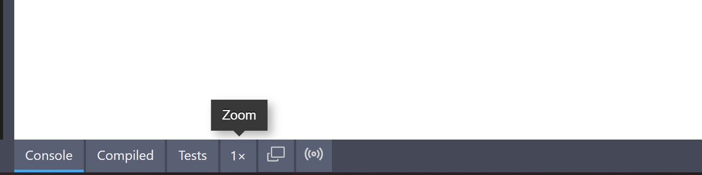

# Result Page

The output of a LiveCodes project is a single HTML page. This includes the (compiled) code from editors (markup + style + script) and [external resources](./external-resources.md) (CSS + JS), in addition to customizations specified in [custom settings](../advanced/custom-settings.md).

This page is loaded in a [sandboxed iframe](https://www.html5rocks.com/en/tutorials/security/sandboxed-iframes/) with a unique origin to enforce [security](./security.md). The page code is sent to the iframe in the browser (no code is sent to the server).

## Result page structure

This is the pseudo-code for the structure of the result page (inspired by [CodePen docs](https://blog.codepen.io/documentation/preview-template/)).

<!-- prettier-ignore -->
```html
<!DOCTYPE html>
<html lang="en" class="{ customSettings.htmlClasses }">
  <head>
    <meta charset="UTF-8" />
    <meta name="viewport" content="width=device-width, initial-scale=1.0" />
    <title>{ Title }</title>

    { customSettings.head }

    { CSS preset }

    { External CSS }

    { Editor CSS }

    { Language(s) run-time CSS }*

    { Language(s) run-time JS }*

    { Import map }

  </head>
  <body>

    { Editor HTML }
    
    { External JS }

    { Editor JS }

    { Spacing script (if enabled) }**

    { Test scripts (if enabled) }

  </body>
</html>
```

\* Although most languages are compiled and then the compiled code is used, some languages require run-time scripts or styles to run in the result page.

\*\* See [Show Sapcings](#show-spacings).

## Result page zoom

The zoom button in the [tools pane](./tools-pane.md) below result page, allows you to toggle result page zoom (1x/0.5x/0.25x).



## Open in new window

From the [tools pane](./tools-pane.md), the result page can be viewed in a separate window.


:::caution

Please note that the URL of the result page shown in the new window is a [temporary URL](https://developer.mozilla.org/en-US/docs/Web/API/URL/createObjectURL#parameters), for local preview. Sharing this URL will not work.

If you need to share a project, use the [Share screen](./share). While, if you need to share the result page use the [broadcast](./broadcast.md) feature.

:::

## Show Spacings

The spacing between elements on the result page can be measured by adding [Spacing.js](https://spacingjs.com/) to the result page.


1. Enable `Show Spacing` setting in the app menu.
2. Move your cursor to an element and press Alt on Windows, or Option on a Mac.
3. Move your cursor to another element, the measurement results will be there.

:::note

`Show Spacing` is only available when viewing the result page in the app. It is not added to the result page for example when [exported](./export.md) or [deployed](./deploy.md).

:::
