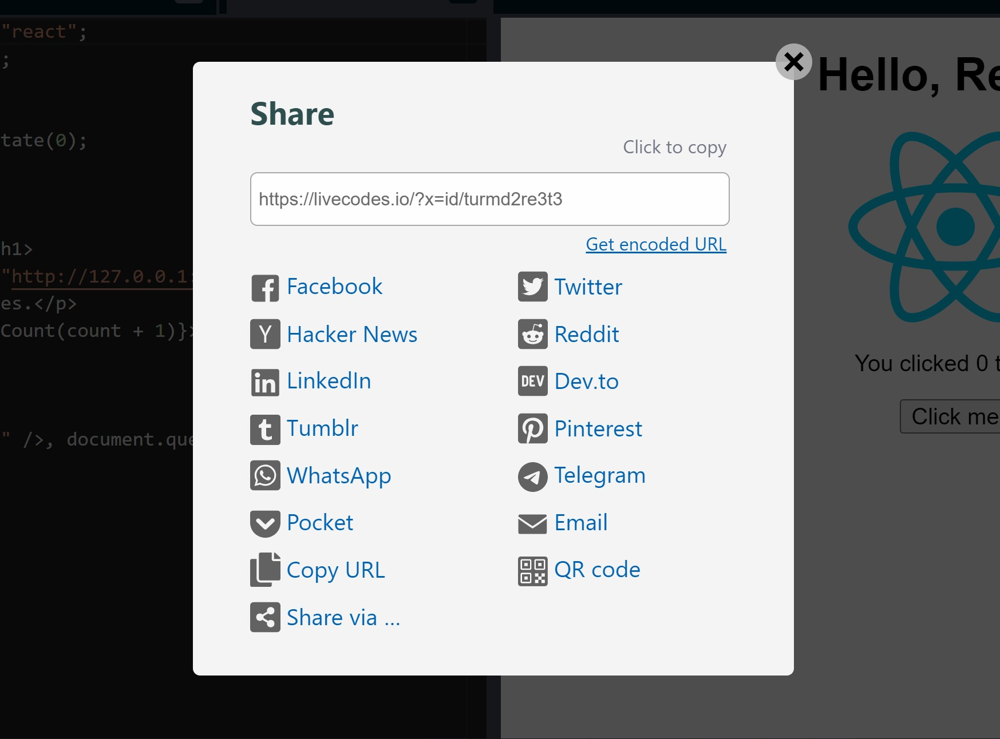

# Share

It is easy to share LiveCodes projects!

A URL is generated to load the shared project. This URL can be copied or shared to different social media.

The share screen can be accessed from the share icon at the top right or from the app menu → Share.

By default, the generated URL encodes the project configuration in a base-64-encoded compressed query string. This step is generated locally in the browser without sending the code to any server. However, depending on the size of the project, the URL can be very long. The length of the URL is indicated in the share screen. [Try not to use very long URLs](https://stackoverflow.com/questions/417142/what-is-the-maximum-length-of-a-url-in-different-browsers) to ensure cross-browser compatibility.

When requested by the user, short URLs can be generated. This requires sending the project configuration (**including source code**) to a server that saves the code and provides a short Id which can be used to retrieve the project.

:::caution

Generating a short URL for sharing requires sending the project configuration (**including source code**) to LiveCodes share service. **It cannot then be deleted**.

:::

:::info Note

The app hosted on [`https://livecodes.io`](https://livecodes.io) uses an API endpoint specifically provided to generate short URLs for LiveCodes share service. We will make every effort to keep that online and available for free use, so long as it is not abused. Please help keep it available by not abusing it and by [sponsoring the project](../sponsor.md).

Short URLs generated by LiveCodes share service are **private** by default and are not listed or indexed.

However, [**self-hosted apps**](./self-hosting.md) use the free service [dpaste](https://dpaste.com/) for short URLs which are [**deleted after 365 days**](https://dpaste.com/help). You may want to use a [custom service](../advanced/services.md) instead. LiveCodes [sponsors](../sponsor.md) (Bronze sponsors and above) get access to managed custom services.

:::

QR code can be generated for the share URL. This can then be scanned by any QR code scanner (e.g. mobile/tablet camera) to load the project on other devices without having to send the link. Please note that generating QR code also requires generating a short URL (code is sent to the share service - see above).

## Related

- [Export](./export.md)
- [Import](./import.md)
- [Deploy](./deploy.md)
- [Broadcast](./broadcast.md)
- [Backup / Restore](./backup-restore.md)
- [Sync](./sync.md)
- [Permanent URL](./permanent-url.md)
