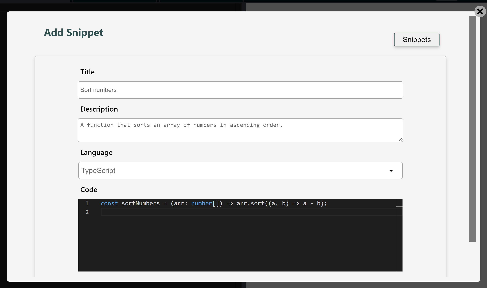
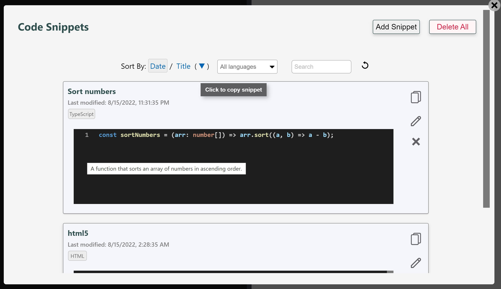

# Code Snippets

LiveCodes supports saving and organizing code snippets in different languages.

Code snippets are saved locally on user's device. However, they are supported in [sync](./sync.md), [backup](./backup-restore.md#backup) and [restore](./backup-restore.md#restore).

Code snippets screen can be accessed from app menu → Code Snippets.

import RunInLiveCodes from '../../src/components/RunInLiveCodes.tsx';

<RunInLiveCodes params={{screen: 'snippets'}} linkText="direct link" />

Each snippet has a title, description, language and code.

After adding snippets they can be sorted (by date modified or title), filtered (by language) or searched.

Clicking on a snippet causes the code to be copied to clipboard. This can then be pasted in projects.

## Related

- [Projects](./projects.md)
- [Assets](./assets.md)
