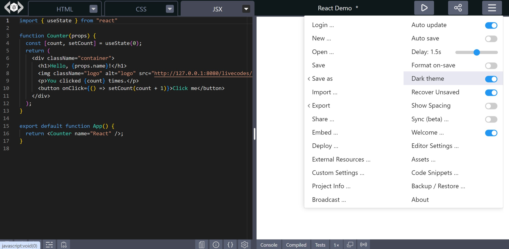
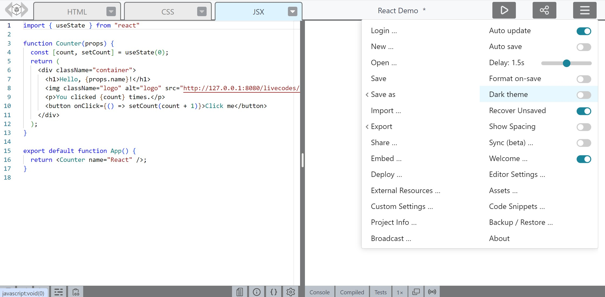

# Themes

LiveCodes comes with dark and light themes.

Themes can be set in:

- UI: app menu → Dark theme switch.

- [Query params](../configuration/query-params.md): `?theme=dark` or `?theme=light`.  
  e.g. https://livecodes.io/?theme=light

- [Configuration object](../configuration/configuration-object.md): [`theme`](../configuration/configuration-object.md#theme) property.

LiveCodes dark theme

LiveCodes light theme

Please note that editor themes can be set in the [editor settings](./editor-settings.md) or using the [`editorTheme`](../configuration/configuration-object.md#editortheme) configuration option.
