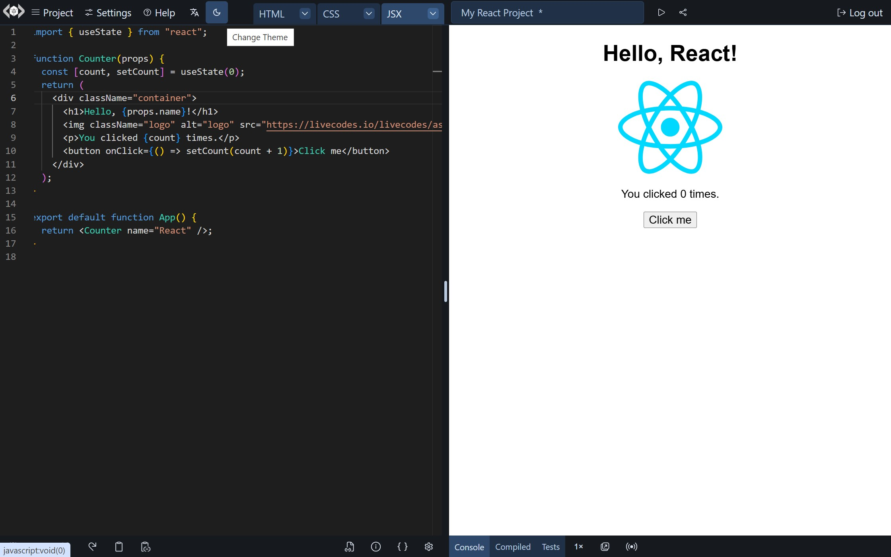
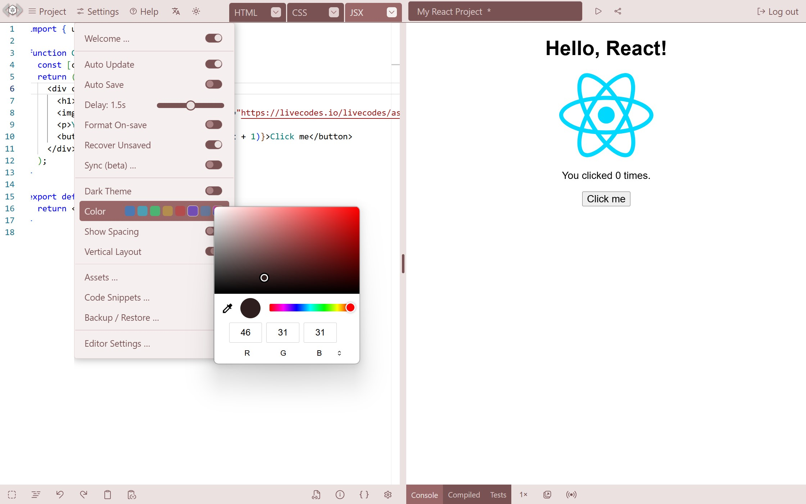

# Themes

import ThemeDemo from '../../src/components/ThemeDemo.tsx'

LiveCodes comes with dark and light themes. In addition, a theme color can be set to change the app color.

## Theme

Dark/Light theme can be set in:

- UI, either:

  - Dark/Light theme switch in toolbar
  - Settings menu → Dark theme switch

- [Query params](../configuration/query-params.md): `?theme=dark` or `?theme=light`.  
  e.g. https://livecodes.io/?theme=light

- [Configuration object](../configuration/configuration-object.md): [`theme`](../configuration/configuration-object.md#theme) property.

LiveCodes dark theme

LiveCodes light theme

## Theme Color

Similarly, a theme color can be set in:

- UI: Settings menu → Color

- [Query params](../configuration/query-params.md): `?themeColor={color}`.  
  e.g. https://livecodes.io/?themeColor=lightblue

- [Configuration object](../configuration/configuration-object.md): [`themeColor`](../configuration/configuration-object.md#themecolor) property.

Change theme color from UI

Custom theme color

## Demo

<ThemeDemo></ThemeDemo>

:::info Note
Please note that editor themes can be set in the [editor settings](./editor-settings.md) or using the [`editorTheme`](../configuration/configuration-object.md#editortheme) configuration option.
